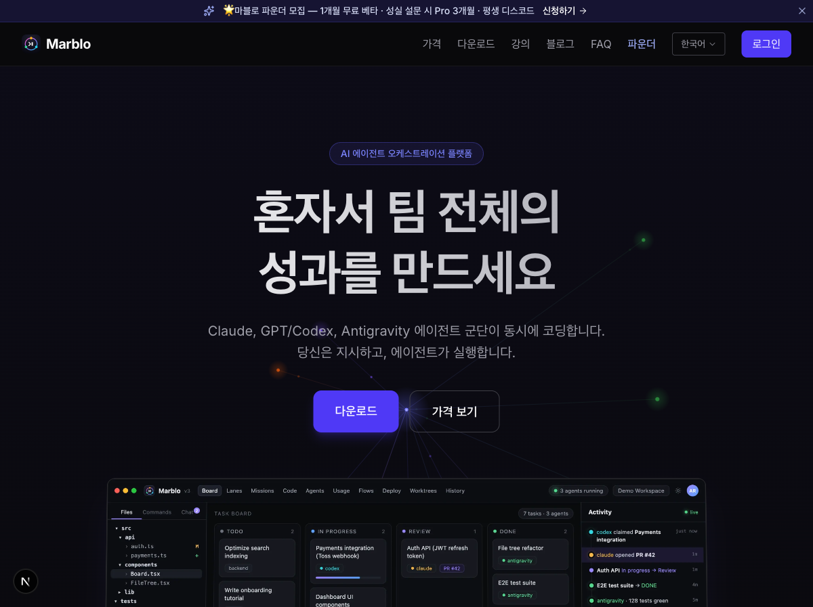
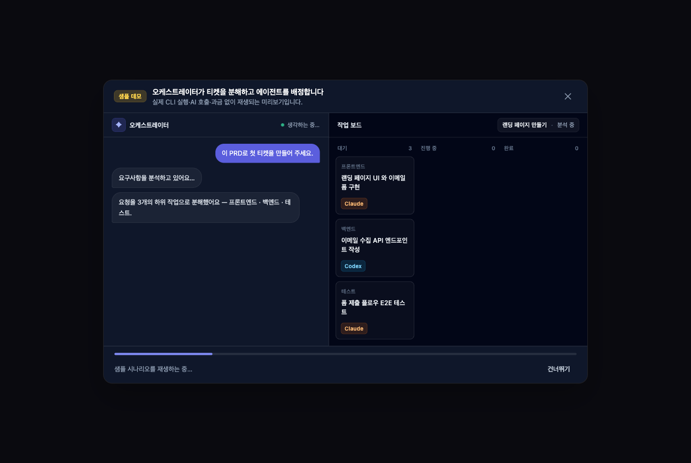
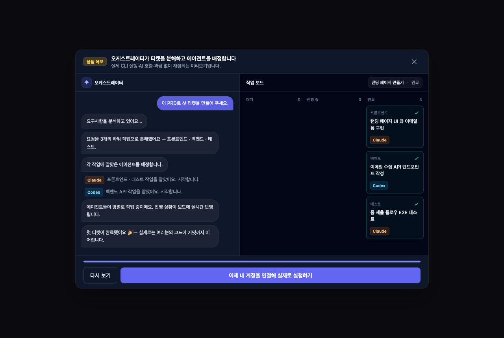
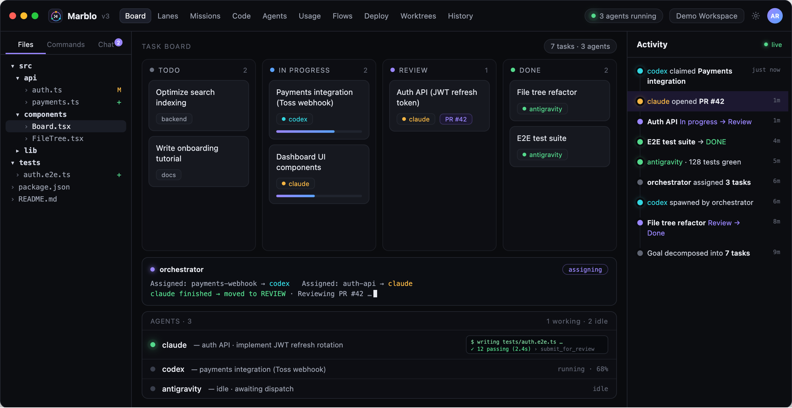

<h1 align="center">
  <a href="https://marblo.app"></a>
  Marblo
</h1>

<p align="center">
  
  <a href="https://github.com/melocream/marblo-releases/releases/latest"></a>
  <a href="https://marblo.app"></a>
  <a href="mailto:team@marblo.app"></a>
</p>

<p align="center">
  <strong>The live orchestrator for AI-native teams.</strong><br/>
  Describe a goal. Marblo’s orchestrator breaks it into tickets, spawns a real<br/>
  AI coding agent for each — Claude, Codex, and more — then tracks, verifies,<br/>
  and safely merges everything they ship. All from one board.
</p>

<h3 align="center">
  <a href="https://github.com/melocream/marblo-releases/releases/latest"><ins>⬇️ Download Marblo</ins></a>
  &nbsp;·&nbsp;
  <a href="https://marblo.app"><ins>🌐 marblo.app</ins></a>
  &nbsp;·&nbsp;
  <a href="https://marblo.app/en/guide"><ins>📖 Guide</ins></a>
</h3>

<p align="center">
  
</p>

---

## ✨ Live orchestration

The thing Marblo does that a single chat window can’t: **run a whole fleet, live.**

One orchestrator decomposes your mission, spawns the right agent per task, heals stuck agents on its own, judges each merge, and checks with you before anything lands.

<p align="center">
  
</p>

> **Mission → auto ticket breakdown → per-model spawn → watchdog self-heal → merge judgment → your confirmation.**

<table>
<tr>
<td width="50%" valign="top" align="center">

**1 · Decompose &amp; assign**<br/>
Natural-language goal → tickets on the board, each with the model that fits.



</td>
<td width="50%" valign="top" align="center">

**2 · Complete &amp; confirm**<br/>
Agents finish in parallel. You review, then merge — nothing lands without you.



</td>
</tr>
</table>

---

## Features

<table>
<tr>
<td width="48%" valign="middle">

### 📋 Board

Kanban for AI agents. Create a ticket — the right agent claims it, works in its own worktree, and the card moves with it.

You see the concrete model on every card (`claude-opus`, `gpt-codex`, `antigravity`).

[Guide →](https://marblo.app/en/guide)

</td>
<td width="52%">
  
</td>
</tr>

<tr>
<td width="48%" valign="middle">

### 🤖 Agents

A live terminal per agent. Watch stdout stream, send follow-ups without killing the session, reuse or hand off mid-run.

The orchestrator keeps the fleet healthy — watchdog self-heal when something stalls.

[Guide →](https://marblo.app/en/guide)

</td>
<td width="52%">
  
</td>
</tr>

<tr>
<td width="48%" valign="middle">

### 💻 Code

Browse and diff each agent’s work across worktrees. Review before merge — no mystery patches on `main`.

[Guide →](https://marblo.app/en/guide)

</td>
<td width="52%">
  
</td>
</tr>

<tr>
<td width="48%" valign="middle">

### 🌿 Worktrees

Every ticket gets an isolated branch. Parallel agents never collide on the same files.

Fan out, compare, merge the winner.

[Guide →](https://marblo.app/en/guide)

</td>
<td width="52%">
  
</td>
</tr>

<tr>
<td width="48%" valign="middle">

### 🎯 Missions

Describe the goal in natural language. Marblo turns it into a ticket graph, then spawns the model that fits each task — diversifying across your fleet instead of locking to one vendor — and runs it all.

[Guide →](https://marblo.app/en/guide)

</td>
<td width="52%">
  
</td>
</tr>

<tr>
<td width="48%" valign="middle">

### ⚡ Lanes

Need parallel _right now_? Fire off several agents at once from the Lanes tab — you pick the model for each. Runs alongside the orchestrator, not through it.

[Guide →](https://marblo.app/en/guide)

</td>
<td width="52%" valign="middle">

### 🔀 Bring your own model

Drop in a vendor key and an agent boots on that model — GLM, Kimi, MiniMax, and local models via Ollama — right next to Claude, Codex, and Grok.

[Guide →](https://marblo.app/en/guide)

</td>
</tr>

<tr>
<td width="48%" valign="middle">

### 📊 Usage

Cost and model usage per agent, project, and day. No more “why was this month’s API bill a surprise?”

[Pricing →](https://marblo.app/en/pricing)

</td>
<td width="52%" valign="middle">

### 🧩 Harness

Per-agent skills and MCP tools. Bring your own from a GitHub repo — connect once, every agent can use it.

[Guide →](https://marblo.app/en/guide)

</td>
</tr>

<tr>
<td width="48%" valign="middle">

### 🕘 History

An append-only ledger of progress, cost, and every merge / deploy decision. Full audit trail for the fleet.

[Guide →](https://marblo.app/en/guide)

</td>
<td width="52%" valign="middle">

### 🚀 Control plane, not just chat

Marblo is where you **manage** agents — board, isolation, cost, and safe merge — not where you wait on a single conversation.

[What is Marblo →](https://marblo.app/en/blog/what-is-marblo)

</td>
</tr>
</table>

**Also in the box**

- **Multi-model fleet** — Claude Code, Codex, Grok, GLM, Kimi, MiniMax, and local models (Ollama) side by side — bring your own key (BYOM)
- **Safe merge** — review and verification before anything hits your main branch
- **Desktop-first** — local execution, your keys, your repos
- **Activity stream** — live structured log of who claimed what and when

---

## Why Marblo

| Pain today                           | What Marblo does                          |
| ------------------------------------ | ----------------------------------------- |
| One chat, one agent, you wait        | One orchestrator, many agents in parallel |
| “What’s it doing?” for 30 minutes    | Live board + per-agent terminals          |
| Parallel agents overwrite each other | Worktree-per-ticket isolation             |
| API cost is a black hole             | Usage by agent / model / day              |
| Merge is trust-me                    | Review, verify, then you confirm          |

> Agents are cheap to start. **Knowing what the fleet is doing** is the hard part. That’s the product.

---

## 🧩 Ecosystem — these assets run in the CLI you already have

**You do not need Marblo to use anything in this repository.**

Every first-party asset here is a plain, standards-native file: a `SKILL.md` that drops into `~/.claude/skills/`, an agent definition in the format Claude Code and Codex already read, a knowledge pack that is just markdown. Copy one in and it works in your next session. Installing Marblo is a one-click upgrade on top — never the gate.

### 30-second install, no app required

**🚩 [Fleet Operations](knowledge/fleet-operations/) — the flagship.** What running a heterogeneous fleet of agent CLIs in production actually teaches: which vendor subscriptions open an Anthropic-compatible endpoint (and why "ships its own CLI" is the wrong test), per-harness resume contracts that kill the process on the wrong flag, why PTY output is the wrong agent-liveness signal in _both_ directions, where cost attribution silently breaks, and worktree-per-ticket hygiene. Measured, not inferred. **[Just read it →](knowledge/fleet-operations/KNOWLEDGE.md)**

```bash
# Keep it where your agents can find it
mkdir -p ~/.claude/skills/fleet-operations && curl -sL \
  https://raw.githubusercontent.com/marblo-app/marblo/main/knowledge/fleet-operations/KNOWLEDGE.md \
  -o ~/.claude/skills/fleet-operations/SKILL.md
```

**[Code Review skill](skills/code-review/)** — review a diff for correctness, security, and simplicity; findings ranked by severity, each with a concrete failure scenario.

```bash
# Claude Code
mkdir -p ~/.claude/skills/code-review && curl -sL \
  https://raw.githubusercontent.com/marblo-app/marblo/main/skills/code-review/SKILL.md \
  -o ~/.claude/skills/code-review/SKILL.md

# Codex — same file, different directory
mkdir -p ~/.codex/skills/code-review && cp ~/.claude/skills/code-review/SKILL.md ~/.codex/skills/code-review/
```

**[Reviewer agent](agents/reviewer/)** — a read-only subagent that reviews the diff against its merge base and returns BLOCK or APPROVE.

```bash
mkdir -p ~/.claude/agents && curl -sL \
  https://raw.githubusercontent.com/marblo-app/marblo/main/agents/reviewer/AGENT.md \
  -o ~/.claude/agents/reviewer.md
```

**[LLM study pack](knowledge/curated-llm-resources/)** — a source-verified learning path (foundations → agents & MCP → RAG → evals → observability). Read it on GitHub; nothing to install.

### 🇰🇷 Korea coverage — the part a global registry doesn't have

Eight referenced items covering work that Korean-language and Korean-market agents actually hit: an `.hwp` an agent cannot open, a 조문 citation a model invented, a DART filing that has no US equivalent. All are `community` tier — **listed and pinned, not one-click-installable** — and each README states what was measured on 2026-07-29, including the ones with problems.

| Item                                                                      | What it does                                                          | License    |
| ------------------------------------------------------------------------- | --------------------------------------------------------------------- | ---------- |
| **[kordoc](mcp-servers/kordoc/)**                                         | HWP/HWPX/PDF/Office → Markdown, compare and generate. CLI + MCP.      | MIT        |
| **[korean-law-mcp](mcp-servers/korean-law-mcp/)**                         | 법제처 statutes and case law, with citation verification.             | MIT        |
| **[korea-stock-mcp](mcp-servers/korea-stock-mcp/)**                       | DART filings + XBRL financials, KRX prices.                           | ISC        |
| **[naver-search-mcp](mcp-servers/naver-search-mcp/)**                     | Naver search + DataLab trends. ⚠️ upstream API migration in progress. | MIT        |
| **[data-go-mcp](mcp-servers/data-go-mcp/)**                               | Six servers over data.go.kr. ⚠️ upstream quiet since 2025-09.         | Apache-2.0 |
| **[korean-legal-doc-drafter](skills/korean-legal-doc-drafter/)**          | Drafts Korean legal documents from 150 reference guides.              | Apache-2.0 |
| **[hwpx-editing](skills/hwpx-editing/)**                                  | Edit `.hwpx` without corrupting it — rules + Python tools.            | MIT        |
| **[awesome-korean-agent-skills](knowledge/awesome-korean-agent-skills/)** | Index of Korean agent skills. ⚠️ AI-operated list, per upstream.      | CC0-1.0    |

Two Korean projects we found and did **not** list, because the reason matters more than the count: one 221-star curated list ships no LICENSE file at all, and one 261-star plugin marketplace is licensed non-commercial, no-derivatives. Neither belongs in a store people install from at work.

Two items here are **not** standalone, and we would rather say so than pretend: [`marblo-control`](mcp-servers/marblo-control/) ships inside the app, and [`review-and-merge`](workflows/review-and-merge/) describes Marblo's orchestration flow. The [`github`](mcp-servers/github/) MCP server is a manifest-only reference — install it from upstream's own instructions at the pinned tag.

### Community catalog — good work by other people, pinned and linked

These are **not ours and not copied here.** Each is a `marblo.yaml` pointing at an upstream repository at a pinned tag or commit SHA, so the license, the ownership, and the maintenance all stay with the author. Every one was picked on a single test: **it works in the CLI you already run, with or without Marblo.** Each item's README carries an install snippet that was executed before it was written down.

They merge as `community` tier — **listed, not one-click-installable** — until the app ships a permission gate. [Why](SECURITY.md#why-community-items-cannot-be-installed-with-one-click).

| Item                                                                                 | Type     | Upstream                                | Pin       |
| ------------------------------------------------------------------------------------ | -------- | --------------------------------------- | --------- |
| [MCP Builder](skills/anthropic-mcp-builder/)                                         | skill    | anthropics/skills                       | `b29e7cf` |
| [Webapp Testing](skills/anthropic-webapp-testing/)                                   | skill    | anthropics/skills                       | `b29e7cf` |
| [Skill Creator](skills/anthropic-skill-creator/)                                     | skill    | anthropics/skills                       | `b29e7cf` |
| [Systematic Debugging](skills/superpowers-systematic-debugging/)                     | skill    | obra/superpowers                        | `v6.2.0`  |
| [Test-Driven Development](skills/superpowers-test-driven-development/)               | skill    | obra/superpowers                        | `v6.2.0`  |
| [Verification Before Completion](skills/superpowers-verification-before-completion/) | skill    | obra/superpowers                        | `v6.2.0`  |
| [DevOps Troubleshooter](agents/wshobson-devops-troubleshooter/)                      | agent    | wshobson/agents                         | `c4b82b0` |
| [Observability Engineer](agents/wshobson-observability-engineer/)                    | agent    | wshobson/agents                         | `c4b82b0` |
| [Multi-Agent Coordinator](agents/voltagent-multi-agent-coordinator/)                 | agent    | VoltAgent/awesome-claude-code-subagents | `947b44c` |
| [TDD Cycle](workflows/wshobson-tdd-cycle/)                                           | workflow | wshobson/agents                         | `c4b82b0` |
| [Incident Response](workflows/wshobson-incident-response/)                           | workflow | wshobson/agents                         | `c4b82b0` |
| [Security Hardening](workflows/wshobson-security-hardening/)                         | workflow | wshobson/agents                         | `c4b82b0` |

Worth knowing about the three Anthropic skills: the `anthropics/skills` repository root ships **no** `LICENSE` file, so the GitHub API reports it as unlicensed. The license is per-skill — each of the three folders above carries its own Apache-2.0 `LICENSE.txt`, and it travels with the install. We checked rather than assumed, and each item's README says so.

### What's open and what isn't

Being explicit about this, because a closed core that presents itself as an open ecosystem is worse than either one honestly labeled:

> **The orchestration engine is our product, and it is closed.** The board, the live orchestrator, worktree isolation, cost attribution, and safe merge are the paid app. **Everything the agents _consume_ is open and portable** — skills, agents, workflows, MCP manifests, and knowledge packs, all of which work whether or not you ever install Marblo. First-party assets are MIT or CC-licensed; referenced community items keep their upstream license (MIT and Apache-2.0 today), declared in each manifest.

Assets are portable by design. If you stop using Marblo, everything in this repo keeps working.

### Repository layout

```text
knowledge/    # Knowledge Packs — fleet-operations (flagship), curated-llm-resources
skills/       # first-party skills (e.g. code-review) + pinned community references
agents/       # agent definitions (e.g. reviewer) + pinned community references
workflows/    # multi-step flows — review-and-merge is Marblo-specific; community ones are portable
mcp-servers/  # official + referenced MCP servers (e.g. marblo-control, github)
skills/       # first-party skills (e.g. code-review) + referenced ones (e.g. hwpx-editing)
agents/       # agent definitions (e.g. reviewer)
workflows/    # multi-step flows (e.g. review-and-merge) — Marblo-specific
mcp-servers/  # official + referenced MCP servers (e.g. marblo-control, github, kordoc)
registry/     # manifests + manifest.schema.json (additive Store metadata)
docs/         # getting-started, concepts, harness-store, orchestration, troubleshooting
```

A `marblo.yaml` sits next to each item. It is **additive Store metadata, not a container** — the asset works without it.

- **Plan & roadmap:** [ROADMAP.md](ROADMAP.md) · **Registry:** [registry/](registry/) · **Docs:** [docs/](docs/)
- **Contribute an item:** [CONTRIBUTING.md](CONTRIBUTING.md). Community submissions are accepted as **listings** — discoverable and linkable, not one-click installable — until the app ships a permission gate and review workflow. [Why →](SECURITY.md)
- **Security:** [SECURITY.md](SECURITY.md) · [SECURITY-ADVISORIES.md](SECURITY-ADVISORIES.md)

> ⭐ Star the repo to follow the ecosystem as it grows.

---

## Download

| Platform                        | Get it                                                                                                |
| ------------------------------- | ----------------------------------------------------------------------------------------------------- |
| 🖥 **Desktop (macOS · Windows)** | [Download latest release](https://github.com/melocream/marblo-releases/releases/latest) — **v3.0.19** |
| 🌐 **Web**                      | [marblo.app](https://marblo.app)                                                                      |
| 📖 **Guide**                    | [marblo.app/en/guide](https://marblo.app/en/guide)                                                    |
| 💰 **Pricing**                  | [marblo.app/en/pricing](https://marblo.app/en/pricing)                                                |

> After install you’ll connect your existing AI CLIs (Claude Code, Codex, …). AI usage is billed to those accounts — not included in the Marblo fee.

---

## Links

- 🏠 Product site — [marblo.app](https://marblo.app)
- ⬇️ Releases — [github.com/melocream/marblo-releases](https://github.com/melocream/marblo-releases/releases/latest)
- ✉️ Contact — [team@marblo.app](mailto:team@marblo.app)
- 🧑‍💻 Founder — [@melocream](https://github.com/melocream)

---

<p align="center">
  <sub>Maintained by <a href="https://github.com/melocream">@melocream</a> · <a href="mailto:team@marblo.app">team@marblo.app</a></sub>
</p>
