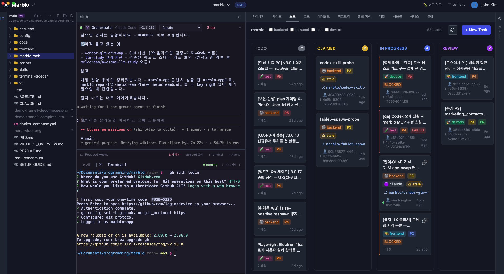

  

<h1 align="center">Marblo</h1>
<h3 align="center">The live orchestrator for AI-native teams</h3>

  Describe a goal. Marblo's <b>orchestrator</b> breaks it into tickets, spawns a real 
  AI coding agent for each — Claude, Codex, and more — then tracks, verifies, and 
  safely merges everything they ship. All from one board.

  <a href="https://github.com/melocream/marblo-releases"><b>⬇️ Download</b></a> ·
  <a href="https://marblo.app">🌐 marblo.app</a> ·
  <a href="mailto:team@marblo.app">✉️ Contact</a>

---

## ✨ Live orchestration

The thing Marblo does that a single chat window can't: **run a whole fleet, live.**
One orchestrator decomposes your mission, spawns the right agent per task, heals
stuck agents on its own, judges each merge, and checks with you before anything lands.

  

> **Mission → auto ticket breakdown → per-model spawn → watchdog self-heal → merge judgment → your confirmation.**

  

---

## The whole workspace, in one window

A three-pane IDE-style shell: your **files** on the left, the **orchestrator and
agent terminals** in the middle, and the **board** on the right — every tab one click away.

  

- 📋 **Board** — kanban tickets; claim one and a real agent spawns in its own worktree (you see the concrete model, e.g. `claude-opus-5`, `gpt-5.6-sol`)
- 🤖 **Agents** — a live terminal per agent; watch, reuse, or hand off
- 💻 **Code** — browse and diff each agent's work across worktrees
- 🌿 **Worktrees** — every ticket gets an isolated branch; parallel, zero collisions
- 📊 **Usage** — cost and model usage per agent, project, and day
- 🧩 **Harness** — per-agent skills and MCP tools, bring your own from a GitHub repo
- 🕘 **History** — an immutable ledger of progress, cost, and every merge/deploy decision

---

## Why Marblo

- 🎯 **One orchestrator, many agents** — decompose once, spawn the right model per task
- 🌿 **Isolated by design** — worktree-per-ticket means parallel work never collides
- 📒 **Everything on the record** — an append-only ledger of cost and decisions
- ✅ **Safe merge** — review and verification before anything hits your main branch

## Download

- 🖥 **Desktop app** → [melocream/marblo-releases](https://github.com/melocream/marblo-releases)
- 🌐 **Web** → [marblo.app](https://marblo.app)

---

Maintained by <a href="https://github.com/melocream">@melocream</a> · team@marblo.app

