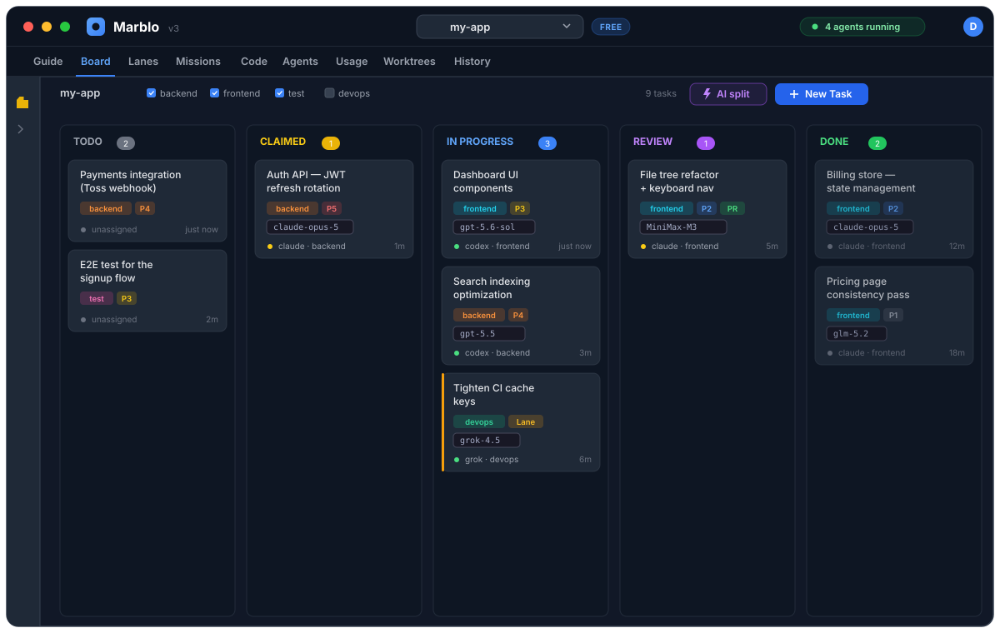
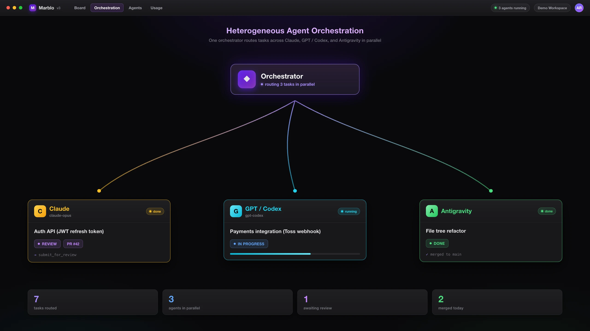
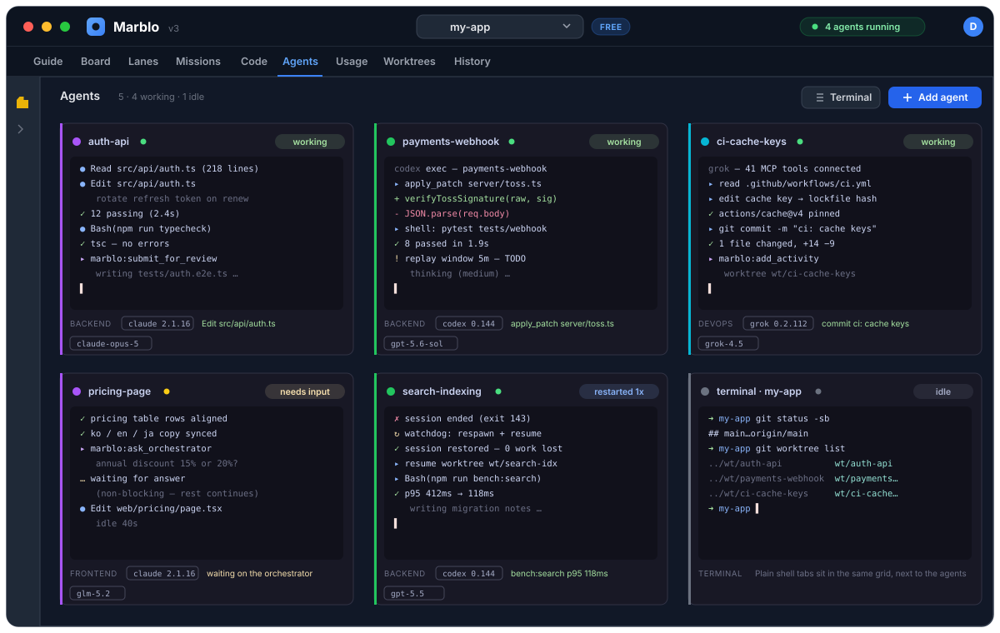
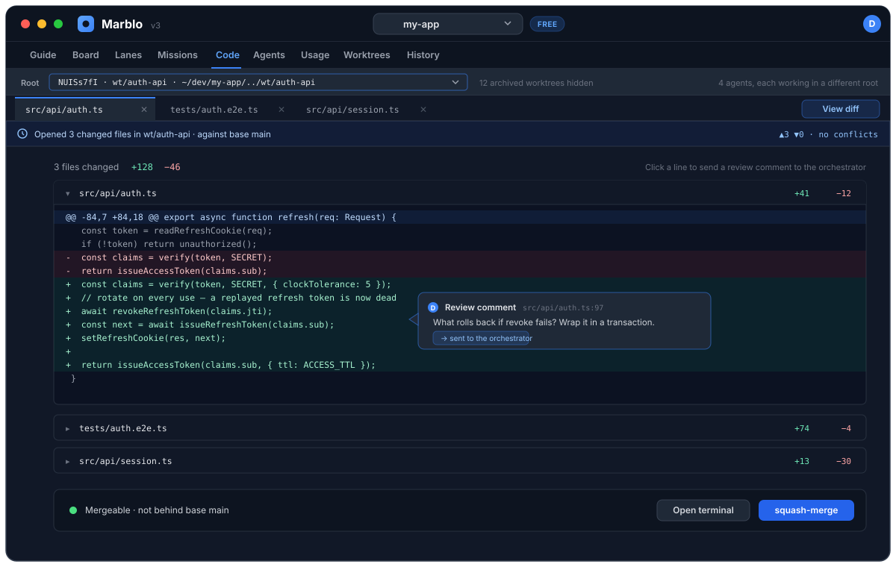
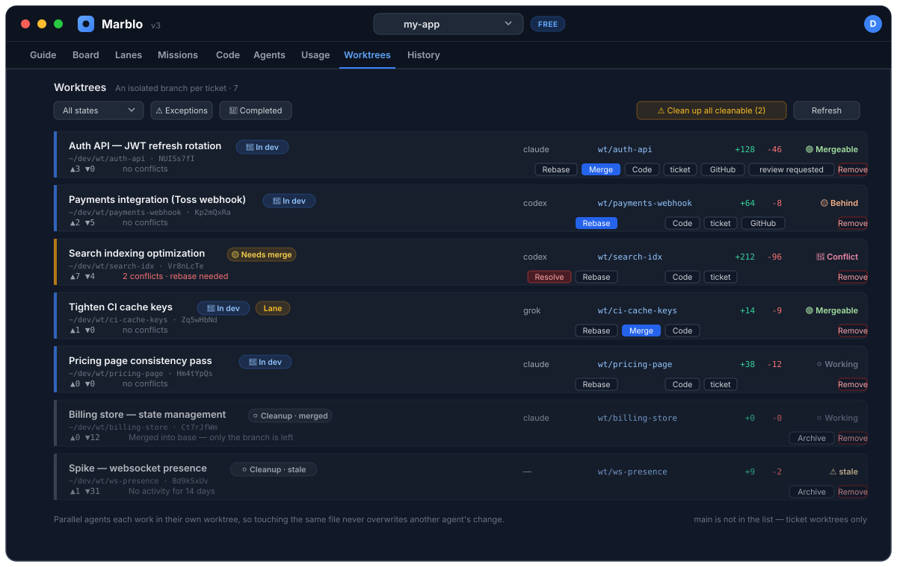
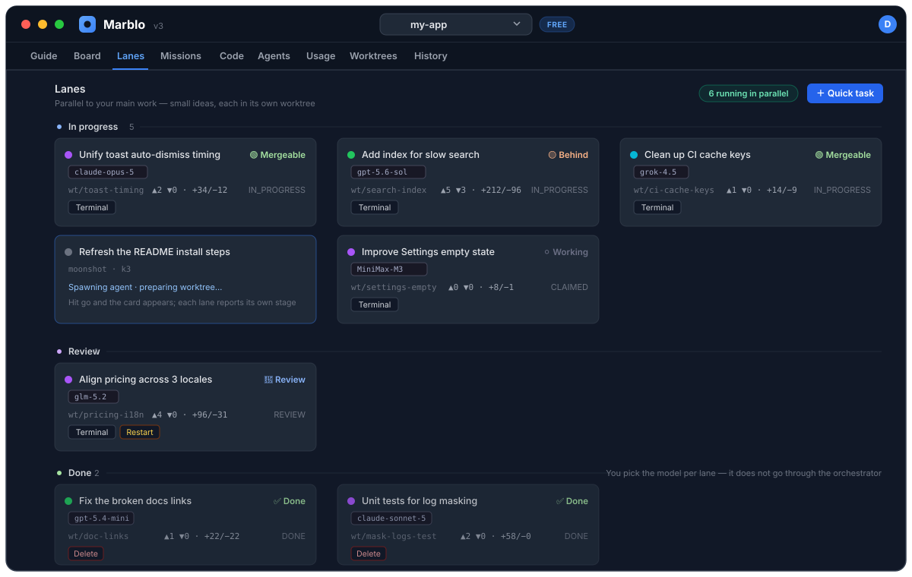
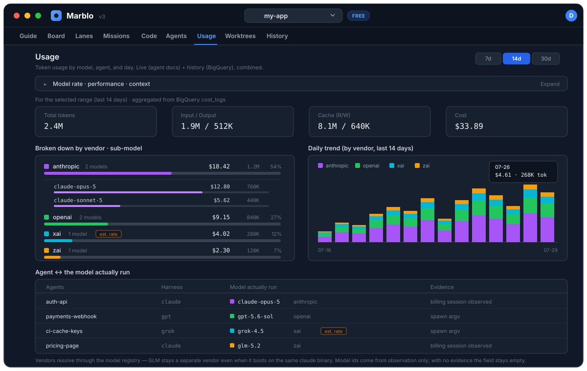
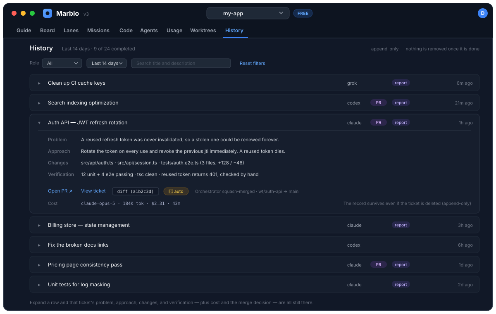

<h1 align="center">
  <a href="https://marblo.app"></a>
  Marblo
</h1>

<p align="center">
  <strong>The live orchestrator for AI-native teams.</strong><br/>
  Describe a goal. One orchestrator breaks it into tickets, spawns a real coding agent for each —<br/>
  Claude, Codex, Grok, and more — and runs them in parallel, each in its own worktree.<br/>
  You watch it happen on one board, see what it costs, and decide what merges.
</p>

<p align="center">
  <a href="https://github.com/melocream/marblo-releases/releases/latest"></a>
  <a href="#install-in-30-seconds--no-app-required"></a>
  <a href="LICENSE"></a>
  <a href="https://marblo.app"></a>
</p>

<h3 align="center">
  <a href="https://github.com/melocream/marblo-releases/releases/latest"><ins>⬇️ Download Marblo</ins></a>
  &nbsp;·&nbsp;
  <a href="#install-in-30-seconds--no-app-required"><ins>⚡ 30-second install</ins></a>
  &nbsp;·&nbsp;
  <a href="#full-catalog--every-item-in-the-repo"><ins>🧩 Catalog</ins></a>
  &nbsp;·&nbsp;
  <a href="https://marblo.app/en/guide"><ins>📖 Guide</ins></a>
</h3>

<p align="center">
  
</p>

<p align="center">
  <sub>Every card names the agent <em>and</em> the model actually running it — <code>claude-opus-5</code>, <code>gpt-5.6-sol</code>, <code>grok-4.5</code>, <code>glm-5.2</code>, <code>MiniMax-M3</code>.</sub>
</p>

---

## Install in 30 seconds — no app required

**Everything in this repository is a plain file that works in the CLI you already run.** Start here — installing the app is an upgrade on top, never the gate.

**🚩 [Fleet Operations](knowledge/fleet-operations/) — the flagship knowledge pack.** What running a heterogeneous fleet of agent CLIs in production actually teaches: which vendor subscriptions open an Anthropic-compatible endpoint (and why "ships its own CLI" is the wrong test), per-harness resume contracts that kill the process on the wrong flag, why PTY output is the wrong agent-liveness signal in _both_ directions, where cost attribution silently breaks, and worktree-per-ticket hygiene. Measured, not inferred.

```bash
# Keep it where your agents can find it
mkdir -p ~/.claude/skills/fleet-operations && curl -sL \
  https://raw.githubusercontent.com/marblo-app/marblo/main/knowledge/fleet-operations/KNOWLEDGE.md \
  -o ~/.claude/skills/fleet-operations/SKILL.md
```

**[Just read it →](knowledge/fleet-operations/KNOWLEDGE.md)** &nbsp;·&nbsp; **[More skills, agents, and MCP servers ↓](#-ecosystem--these-assets-run-in-the-cli-you-already-have)** &nbsp;·&nbsp; **[Full catalog ↓](#full-catalog--every-item-in-the-repo)**

**Want the fleet, not just the files?** [Download Marblo](https://github.com/melocream/marblo-releases/releases/latest) for macOS or Windows, then connect the CLIs you already pay for. Marblo spawns and tracks them; AI usage stays billed to those accounts.

---

## ✨ Live orchestration

The thing Marblo does that a single chat window can’t: **run a whole fleet, live.**

One orchestrator decomposes your mission, spawns the right agent per task, heals stuck agents on its own, judges each merge, and checks with you before anything lands.

<p align="center">
  
</p>

> **Mission → auto ticket breakdown → per-model spawn → watchdog self-heal → merge judgment → your confirmation.**

**1 · Describe the goal.** Marblo splits it into tickets, picks a model per ticket, and puts them on the board.

<p align="center">
  
</p>

**2 · Watch it run, then confirm.** Agents work in parallel in separate worktrees. You review the diff and merge — nothing lands without you.

---

## The tour — one tab at a time

### 📋 Board

Kanban for AI agents. Create a ticket and the right agent claims it, works in its own worktree, and moves the card as it goes. Every card carries the concrete model, so "which one wrote this?" is never a guess.

<p align="center">
  
</p>

### 🤖 Agents

A live terminal per agent. Watch stdout stream, send a follow-up without killing the session, reuse or hand off mid-run. The watchdog respawns and resumes an agent that stalls, and an agent that needs a decision says so instead of going quiet.

<p align="center">
  
</p>

### 💻 Code

Browse and diff each agent’s work across worktrees before it merges. Click a line to send a review comment straight to the orchestrator — no mystery patches on `main`.

<p align="center">
  
</p>

### 🌿 Worktrees

Every ticket gets an isolated branch and checkout, so parallel agents never collide on the same files. Merge state, conflicts, ahead/behind and cleanup all live in one list.

<p align="center">
  
</p>

<details>
<summary><strong>More tabs — Lanes, Usage, History</strong></summary>

<br/>

### ⚡ Lanes

Need parallel work _right now_, without a mission? Fire off several agents at once and pick the model for each. Runs alongside the orchestrator, not through it.

<p align="center">
  
</p>

### 📊 Usage

Cost and token usage by model, agent, and day. It also shows which model each agent _actually_ ran and what the evidence for that was — an observed billing session or the spawn argv — and leaves the field empty when there is none.

<p align="center">
  
</p>

### 🕘 History

An append-only ledger of what each ticket did: problem, approach, changes, verification, cost, and the merge decision. It survives the ticket being deleted.

<p align="center">
  
</p>

</details>

**Also in the box**

- **Multi-model fleet** — Claude Code, Codex, Grok, GLM, Kimi, MiniMax, and local models (Ollama) side by side — bring your own key (BYOM)
- **Missions** — a natural-language goal becomes a ticket graph, spawned across your fleet instead of locked to one vendor
- **Harness** — per-agent skills and MCP tools, including your own from a GitHub repo: connect once, every agent can use it
- **Safe merge** — review and verification before anything hits your main branch
- **Desktop-first** — local execution, your keys, your repos

---

## Why Marblo

| Pain today                           | What Marblo does                          |
| ------------------------------------ | ----------------------------------------- |
| One chat, one agent, you wait        | One orchestrator, many agents in parallel |
| “What’s it doing?” for 30 minutes    | Live board + per-agent terminals          |
| Parallel agents overwrite each other | Worktree-per-ticket isolation             |
| API cost is a black hole             | Usage by agent / model / day              |
| Merge is trust-me                    | Review, verify, then you confirm          |

> Agents are cheap to start. **Knowing what the fleet is doing** is the hard part. That’s the product.

---

## 🧩 Ecosystem — these assets run in the CLI you already have

**You do not need Marblo to use anything in this repository.**

Every first-party asset here is a plain, standards-native file: a `SKILL.md` that drops into `~/.claude/skills/`, an agent definition in the format Claude Code and Codex already read, a knowledge pack that is just markdown. Copy one in and it works in your next session. Installing Marblo is a one-click upgrade on top — never the gate.

### More one-liners

The flagship [Fleet Operations](knowledge/fleet-operations/) pack is [at the top of this README](#install-in-30-seconds--no-app-required). The rest install the same way:

**[Code Review skill](skills/code-review/)** — review a diff for correctness, security, and simplicity; findings ranked by severity, each with a concrete failure scenario.

```bash
# Claude Code
mkdir -p ~/.claude/skills/code-review && curl -sL \
  https://raw.githubusercontent.com/marblo-app/marblo/main/skills/code-review/SKILL.md \
  -o ~/.claude/skills/code-review/SKILL.md

# Codex — same file, different directory
mkdir -p ~/.codex/skills/code-review && cp ~/.claude/skills/code-review/SKILL.md ~/.codex/skills/code-review/
```

**[Reviewer agent](agents/reviewer/)** — a read-only subagent that reviews the diff against its merge base and returns BLOCK or APPROVE.

```bash
mkdir -p ~/.claude/agents && curl -sL \
  https://raw.githubusercontent.com/marblo-app/marblo/main/agents/reviewer/AGENT.md \
  -o ~/.claude/agents/reviewer.md
```

**[LLM study pack](knowledge/curated-llm-resources/)** — a source-verified learning path (foundations → agents & MCP → RAG → evals → observability). Read it on GitHub; nothing to install.

### 🇰🇷 Korea coverage — the part a global registry doesn't have

Referenced items covering work that Korean-language and Korean-market agents actually hit: an `.hwp` an agent cannot open, a 조문 citation a model invented, a DART filing that has no US equivalent. They are `community` tier — **listed and pinned, not one-click-installable** — and each item's README states what was measured when it was listed, including the ones with problems. They are flagged **🇰🇷** in the catalog below; the count lives there rather than here, so it cannot go stale.

Two Korean projects we found and did **not** list, because the reason matters more than the count: one 221-star curated list ships no LICENSE file at all, and one 261-star plugin marketplace is licensed non-commercial, no-derivatives. Neither belongs in a store people install from at work.

Some items here are **not** standalone, and we would rather say so than pretend: [`marblo-control`](mcp-servers/marblo-control/) ships inside the app, and [`review-and-merge`](workflows/review-and-merge/) plus the `tf-*` workflows are Marblo's own orchestration flow written down — they load in your CLI, but every step calls into the Marblo MCP server, so outside Marblo they have nothing to call. The [`github`](mcp-servers/github/) MCP server is a manifest-only reference — install it from upstream's own instructions at the pinned tag.

### Full catalog — every item in the repo

Most of this is **not ours and not copied here.** Each referenced item is a `marblo.yaml` pointing at an upstream repository at a pinned tag or commit SHA, so the license, the ownership, and the maintenance all stay with the author. Every one was picked on a single test: **it works in the CLI you already run, with or without Marblo.** Each item's README carries an install snippet that was executed before it was written down.

The table below is **generated from the manifests** by [`scripts/gen-catalog.mjs`](scripts/gen-catalog.mjs) — every id, description, tier, license, and pin is the value committed in that item's `marblo.yaml`. Adding an item means adding a manifest; nobody edits this table, and CI fails any PR where the two have drifted apart.
<!-- prettier-ignore-start -->
<!-- CATALOG:START -->
<!-- Generated by scripts/gen-catalog.mjs from every <category>/<id>/marblo.yaml.
     Do NOT edit between these markers — run `npm run gen:catalog`.
     CI regenerates this block and fails the PR if it differs from what is committed. -->

**150 items** · 56 MCP servers · 26 skills · 42 agents · 23 workflows · 3 knowledge packs

**Tier** — 🟢 `official` 30 maintained by Marblo · 🔵 `verified` 2 external, reviewed and source-pinned · ⚪ `community` 118 external, listed and pinned but not reviewed.

**Install** — ⚡ **one-click in the app** for 14 items whose install contract is written and digest-verified. Everything else is **— reference**: listed, linked, and pinned, installed by following the item's own README. `community` items are reference-only by policy and stay that way until the app ships a permission gate ([why](SECURITY.md#why-community-items-cannot-be-installed-with-one-click)).

**🇰🇷** marks the 22 items covering Korean-language and Korean-market work.

#### MCP servers (56)

| Item | What it does | Tier | Install | License | Upstream pin |
| --- | --- | --- | --- | --- | --- |
| [airtable-mcp](mcp-servers/airtable-mcp/) | Reads and writes Airtable bases from the agent — list bases and tables, inspect schema, then query, create, update, and delete records. Referenced by manifest; not vendored. | ⚪ `community` | — reference | MIT | [domdomegg/airtable-mcp-server](https://github.com/domdomegg/airtable-mcp-server/tree/v1.14.0) `v1.14.0` |
| [asana-mcp](mcp-servers/asana-mcp/) | Works Asana from the agent — search and read tasks, projects, and portfolios, then create tasks, post comments, and update status. Referenced by manifest; not vendored. | ⚪ `community` | — reference | MIT | [roychri/mcp-server-asana](https://github.com/roychri/mcp-server-asana/tree/v1.6.0) `v1.6.0` |
| [assembly-api-mcp](mcp-servers/assembly-api-mcp/) 🇰🇷 | 287 Korean legislature open APIs behind 6 (Lite) or 11 (Full) MCP tools — members, bills and their committee-to-plenary path, sessions, votes, petitions, minutes, public legislative notices, and NABO budget research. | ⚪ `community` | — reference | MIT | [hollobit/assembly-api-mcp](https://github.com/hollobit/assembly-api-mcp/tree/f74c6b452c59d87e2fa7265fd985b90e4057a8ef) `f74c6b4` |
| [atlassian-mcp](mcp-servers/atlassian-mcp/) | Reads and writes Jira issues and Confluence pages from the agent, against both Atlassian Cloud and Server/Data Center deployments. Referenced by manifest; not vendored. | ⚪ `community` | — reference | MIT | [sooperset/mcp-atlassian](https://github.com/sooperset/mcp-atlassian/tree/v0.23.0) `v0.23.0` |
| [aws-mcp](mcp-servers/aws-mcp/) | AWS Labs' collection of MCP servers — one per service area (API, docs, pricing, CloudWatch, EKS, DynamoDB, and ~55 more), installed individually from the same repo. Referenced by manifest; not vendored. | ⚪ `community` | — reference | Apache-2.0 | [awslabs/mcp](https://github.com/awslabs/mcp/tree/2026.07.20260728181317) `2026.07.20260728181317` |
| [azure-mcp](mcp-servers/azure-mcp/) | Microsoft's official Azure server — query and manage storage, Cosmos DB, Key Vault, AKS, Monitor, and the rest of the resource surface from the agent using your existing Azure sign-in. Referenced by manifest; not vendored. | ⚪ `community` | — reference | MIT | [microsoft/mcp](https://github.com/microsoft/mcp/tree/bd96686782eb9b62c47662b941de4c4b9eb0aaf7/servers/Azure.Mcp.Server) `bd96686` |
| [chroma-mcp](mcp-servers/chroma-mcp/) | Chroma's official server for its embedding database — create collections, add documents, and run semantic, keyword, or metadata queries, against an in-memory, on-disk, or hosted Chroma. Referenced by manifest; not vendored. | ⚪ `community` | — reference | Apache-2.0 | [chroma-core/chroma-mcp](https://github.com/chroma-core/chroma-mcp/tree/v0.2.6) `v0.2.6` |
| [circleci-mcp](mcp-servers/circleci-mcp/) | CircleCI's own MCP server — pull the failure logs of the latest failed pipeline, inspect flaky tests, and validate config without leaving the agent. Referenced by manifest; not vendored. | ⚪ `community` | — reference | Apache-2.0 | [CircleCI-Public/mcp-server-circleci](https://github.com/CircleCI-Public/mcp-server-circleci/tree/8787136b6c8bf72752ebcffad1520c2a847b5276) `8787136` |
| [clickhouse-mcp](mcp-servers/clickhouse-mcp/) | ClickHouse's official server — run SELECT queries against a ClickHouse cluster (read-only by default), list databases and tables, and optionally query local files through embedded chDB. Referenced by manifest; not vendored. | ⚪ `community` | — reference | Apache-2.0 | [ClickHouse/mcp-clickhouse](https://github.com/ClickHouse/mcp-clickhouse/tree/v0.4.1) `v0.4.1` |
| [clickup-mcp](mcp-servers/clickup-mcp/) | Searches, creates, and updates ClickUp tasks from the agent, plus comments and time tracking, with a read-only mode for workspaces that should not be written to. Referenced by manifest; not vendored. | ⚪ `community` | — reference | MIT | [hauptsacheNet/clickup-mcp](https://github.com/hauptsacheNet/clickup-mcp/tree/v1.6.2) `v1.6.2` |
| [cloudflare-mcp](mcp-servers/cloudflare-mcp/) | Cloudflare's official remote MCP servers — docs, Workers bindings and builds, observability, Radar, AI Gateway, AutoRAG, audit logs, and more, each at its own hosted endpoint. Referenced by manifest; not vendored. | ⚪ `community` | — reference | Apache-2.0 | [cloudflare/mcp-server-cloudflare](https://github.com/cloudflare/mcp-server-cloudflare/tree/26c1989472469e79ed31d8e732efd0f2f4841e25) `26c1989` |
| [context7-mcp](mcp-servers/context7-mcp/) | Pulls version-correct library documentation and code examples into the agent's context on demand, so it stops citing APIs that were removed two releases ago. Referenced by manifest; not vendored. | ⚪ `community` | — reference | MIT | [upstash/context7](https://github.com/upstash/context7/tree/b250c2515694eee4b6df4db82fa056df9ed3e306/packages/mcp) `b250c25` |
| [daiso-mcp](mcp-servers/daiso-mcp/) 🇰🇷 | Product, store, and stock lookups across Korean retail — Daiso, Olive Young, Lotte Mart, GS25, CU, 7-Eleven, Emart24 — plus Opinet fuel prices, Naver local place search, and Megabox/Lotte Cinema/CGV showtimes. No API key of your own. | ⚪ `community` | — reference | MIT | [hmmhmmhm/daiso-mcp](https://github.com/hmmhmmhm/daiso-mcp/tree/v1.0.10) `v1.0.10` |
| [data-go-mcp](mcp-servers/data-go-mcp/) 🇰🇷 | Six MCP servers over Korea's public data portal — national pension enrollment, business-registration verification, public procurement bids, corporate financials, presidential speeches, and chemical safety data. | ⚪ `community` | — reference | Apache-2.0 | [Koomook/data-go-mcp-servers](https://github.com/Koomook/data-go-mcp-servers/tree/dd27f99490400b31fa14f96045a138fa217580a4) `dd27f99` |
| [discord-mcp](mcp-servers/discord-mcp/) | Drives a Discord bot from the agent — send and read channel messages, manage channels and roles, and add reactions on a server you administer. Referenced by manifest; not vendored. | ⚪ `community` | — reference | MIT | [SaseQ/discord-mcp](https://github.com/SaseQ/discord-mcp/tree/v1.0.0) `v1.0.0` |
| [docker-mcp-gateway](mcp-servers/docker-mcp-gateway/) | One MCP endpoint in front of many servers — Docker's CLI plugin runs catalog servers in isolated containers, holds their secrets, and exposes the merged tool set to the client. Referenced by manifest; not vendored. | ⚪ `community` | — reference | MIT | [docker/mcp-gateway](https://github.com/docker/mcp-gateway/tree/v0.43.3) `v0.43.3` |
| [duckdb-mcp](mcp-servers/duckdb-mcp/) | MotherDuck's official server — run DuckDB SQL against an in-memory database, a local .duckdb file, or a MotherDuck cloud database, so the agent can analyse CSV and Parquet without a warehouse. Referenced by manifest; not vendored. | ⚪ `community` | — reference | MIT | [motherduckdb/mcp-server-motherduck](https://github.com/motherduckdb/mcp-server-motherduck/tree/v1.0.7) `v1.0.7` |
| [exa-mcp](mcp-servers/exa-mcp/) | Neural web search and crawling built for agents rather than humans, returning page contents instead of a list of blue links. Referenced by manifest; not vendored. | ⚪ `community` | — reference | MIT | [exa-labs/exa-mcp-server](https://github.com/exa-labs/exa-mcp-server/tree/b4076055af28698d944b50deade80e541b7788ea) `b407605` |
| [figma-context-mcp](mcp-servers/figma-context-mcp/) | Turns a Figma frame into the layout data a coding agent can actually use, instead of asking it to reimplement a design from a screenshot. Referenced by manifest; not vendored. | ⚪ `community` | — reference | MIT | [GLips/Figma-Context-MCP](https://github.com/GLips/Figma-Context-MCP/tree/v0.13.2) `v0.13.2` |
| [firecrawl-mcp](mcp-servers/firecrawl-mcp/) | Scrapes and crawls web pages into clean markdown for the agent, handling JavaScript rendering and pagination that a plain fetch tool cannot. Referenced by manifest; not vendored. | 🔵 `verified` | ⚡ one-click (`mcp-server`) | MIT | [firecrawl/firecrawl-mcp-server](https://github.com/firecrawl/firecrawl-mcp-server/tree/2175de2dfd7e5073e9e743ec31a5e2515fa82df8) `2175de2` |
| [gcp-cloud-run-mcp](mcp-servers/gcp-cloud-run-mcp/) | Google Cloud's official server for deploying and inspecting Cloud Run services — deploy a local folder or container, list services, read logs, from the agent. Referenced by manifest; not vendored. | ⚪ `community` | — reference | Apache-2.0 | [GoogleCloudPlatform/cloud-run-mcp](https://github.com/GoogleCloudPlatform/cloud-run-mcp/tree/v1.10.0) `v1.10.0` |
| [github-mcp](mcp-servers/github/) | Official GitHub MCP server — give agents scoped access to repositories, issues, and pull requests. Referenced by manifest; not vendored. | 🔵 `verified` | — reference | MIT | [github/github-mcp-server](https://github.com/github/github-mcp-server/tree/v1.7.0) `v1.7.0` |
| [gitlab-mcp](mcp-servers/gitlab-mcp/) | Reads and writes GitLab from the agent — merge requests, issues, pipelines, files, and wiki — against gitlab.com or a self-managed instance. Referenced by manifest; not vendored. | ⚪ `community` | — reference | MIT | [zereight/gitlab-mcp](https://github.com/zereight/gitlab-mcp/tree/v2.1.43) `v2.1.43` |
| [google-drive-mcp](mcp-servers/google-drive-mcp/) | Drive-scoped file operations — search, read, create, and edit files in Drive, Docs, Sheets, and Slides — for teams that do not want a full Workspace grant. Referenced by manifest; not vendored. | ⚪ `community` | — reference | MIT | [piotr-agier/google-drive-mcp](https://github.com/piotr-agier/google-drive-mcp/tree/v2.5.0) `v2.5.0` |
| [google-workspace-mcp](mcp-servers/google-workspace-mcp/) | One server across Gmail, Calendar, Drive, Docs, Sheets, Slides, Forms, Tasks, and Chat, authenticating with your own Google OAuth client. Referenced by manifest; not vendored. | ⚪ `community` | — reference | MIT | [taylorwilsdon/google_workspace_mcp](https://github.com/taylorwilsdon/google_workspace_mcp/tree/v1.22.2) `v1.22.2` |
| [grafana-mcp](mcp-servers/grafana-mcp/) | Official Grafana server — query dashboards, Prometheus and Loki data sources, incidents, and alert rules from the agent while debugging. Referenced by manifest; not vendored. | ⚪ `community` | — reference | Apache-2.0 | [grafana/mcp-grafana](https://github.com/grafana/mcp-grafana/tree/v1.0.0) `v1.0.0` |
| [kis-mcp-server](mcp-servers/kis-mcp-server/) 🇰🇷 | 166 Korea Investment & Securities REST endpoints across 8 groups, exposed as catalog-driven MCP tools — domestic and overseas quotes, balances, buying power, and order APIs. Order, amend, and cancel calls are blocked by default. Unofficial. | ⚪ `community` | — reference | MIT | [migusdn/KIS_MCP_Server](https://github.com/migusdn/KIS_MCP_Server/tree/595d5d1cdbbe6ae706f030cd196cfa1c12f15ca7) `595d5d1` |
| [kmsg-kakaotalk](mcp-servers/kmsg-kakaotalk/) 🇰🇷 | Read, watch, and send KakaoTalk messages from an agent on macOS. Drives the on-screen KakaoTalk UI through the Accessibility API rather than a private protocol, and emits structured JSON. Unofficial — not a Kakao Corp. product. | ⚪ `community` | — reference | MIT | [channprj/kmsg](https://github.com/channprj/kmsg/tree/v1.260726.0) `v1.260726.0` |
| [ko-stdict-mcp](mcp-servers/ko-stdict-mcp/) 🇰🇷 | Look up headwords in the National Institute of Korean Language's Standard Korean Dictionary. Downloads the official JSON dump once, normalizes it into local SQLite, and serves lookups from there — no Open API key, no per-query network call. | ⚪ `community` | — reference | AGPL-3.0 | [dahlia/ko-stdict-mcp](https://github.com/dahlia/ko-stdict-mcp/tree/0.2.0) `0.2.0` |
| [kordoc](mcp-servers/kordoc/) 🇰🇷 | Parse, compare, and generate the document formats Korean public-sector work runs on — HWP 3.x/5.x, HWPX, HWPML, PDF, XLS(X), DOCX — from an agent. Ships as both a CLI and an MCP server. | ⚪ `community` | — reference | MIT | [chrisryugj/kordoc](https://github.com/chrisryugj/kordoc/tree/v4.2.9) `v4.2.9` |
| [korea-finance-mcp](mcp-servers/korea-finance-mcp/) 🇰🇷 | 19 tools over Bank of Korea ECOS macro series, MOLIT RTMS transaction prices, R-ONE housing indices, DART filings, and KRX quotes — including cross-source correlation such as policy rate against apartment prices. Lookup only, no order path. | ⚪ `community` | — reference | MIT | [emceeKim/korea-finance-mcp](https://github.com/emceeKim/korea-finance-mcp/tree/v1.4.0) `v1.4.0` |
| [korea-realestate-mcp](mcp-servers/korea-realestate-mcp/) 🇰🇷 | Real transaction prices from Korea's MOLIT open API — apartments, officetels, villas, single/multi-household homes, and commercial buildings, sale and jeonse/monthly rent — plus apartment subscription notices and results. 14+ tools. | ⚪ `community` | — reference | MIT | [tae0y/real-estate-mcp](https://github.com/tae0y/real-estate-mcp/tree/v0.1.0) `v0.1.0` |
| [korea-stock-mcp](mcp-servers/korea-stock-mcp/) 🇰🇷 | Korean equity research from official sources — DART regulatory filings with XBRL financial statements, and KRX daily prices and listings for KOSPI/KOSDAQ. | ⚪ `community` | — reference | ISC | [jjlabsio/korea-stock-mcp](https://github.com/jjlabsio/korea-stock-mcp/tree/v1.4.1) `v1.4.1` |
| [korean-law-mcp](mcp-servers/korean-law-mcp/) 🇰🇷 | Korean statutes, case law, administrative rules, and treaties from the 법제처 open APIs, plus citation verification that checks a cited article exists and says what the model claims it says. | ⚪ `community` | — reference | MIT | [chrisryugj/korean-law-mcp](https://github.com/chrisryugj/korean-law-mcp/tree/v4.9.1) `v4.9.1` |
| [korean-patent-mcp](mcp-servers/korean-patent-mcp/) 🇰🇷 | Search Korean patents, utility models, trademarks, and designs through KIPRIS Plus — free-text search, fielded search over IPC/title/abstract/claims, applicant and right-holder lookup, and full bibliographic detail by application number. 7 tools. | ⚪ `community` | — reference | MIT | [chrisryugj/korean-patent-mcp](https://github.com/chrisryugj/korean-patent-mcp/tree/9686dd8ff102324aed642fefeda3102caccce93c) `9686dd8` |
| [kubernetes-mcp](mcp-servers/kubernetes-mcp/) | Talks to a Kubernetes or OpenShift cluster through your existing kubeconfig — list, inspect, apply, and delete resources, read pod logs, and run events triage. Referenced by manifest; not vendored. | ⚪ `community` | — reference | Apache-2.0 | [containers/kubernetes-mcp-server](https://github.com/containers/kubernetes-mcp-server/tree/v0.0.65) `v0.0.65` |
| [linear-mcp](mcp-servers/linear-mcp/) | Reads and writes Linear from the agent — issues, comments, projects, cycles, and status transitions — over Linear's GraphQL API with a personal token. Referenced by manifest; not vendored. | ⚪ `community` | — reference | MIT | [tacticlaunch/mcp-linear](https://github.com/tacticlaunch/mcp-linear/tree/v1.4.1) `v1.4.1` |
| [marblo-control](mcp-servers/marblo-control/) | The MCP server an orchestrator uses to run the board — create and dispatch tickets, spawn and track agents, and record decisions. Ships with the Marblo app. | 🟢 `official` | — reference | MIT | first-party — lives in this repo |
| [mcp-toolbox-databases](mcp-servers/mcp-toolbox-databases/) | One MCP server that fronts many databases, with the queries an agent may run declared up front in a tools file instead of handed to the model as raw SQL. Referenced by manifest; not vendored. | ⚪ `community` | — reference | Apache-2.0 | [googleapis/mcp-toolbox](https://github.com/googleapis/mcp-toolbox/tree/v1.8.0) `v1.8.0` |
| [mongodb-mcp](mcp-servers/mongodb-mcp/) | MongoDB's official server — explore collections, run queries and aggregations, inspect indexes, and drive Atlas cluster administration, with a --readOnly flag that disables every mutating tool. Referenced by manifest; not vendored. | ⚪ `community` | — reference | Apache-2.0 | [mongodb-js/mongodb-mcp-server](https://github.com/mongodb-js/mongodb-mcp-server/tree/v1.14.0) `v1.14.0` |
| [naver-search-mcp](mcp-servers/naver-search-mcp/) 🇰🇷 | Search Naver — news, blogs, cafés, local, encyclopedia — plus DataLab search-trend and shopping-insight analysis. Naver is the search engine most Korean-language content is actually indexed in. | ⚪ `community` | — reference | MIT | [isnow890/naver-search-mcp](https://github.com/isnow890/naver-search-mcp/tree/d7c7c58cab0de2692336b710727f1ee123270e6c) `d7c7c58` |
| [neon-mcp](mcp-servers/neon-mcp/) | Neon's official remote server for serverless Postgres — create projects and branches, run SQL, and drive branch-per-change migrations from the agent. Referenced by manifest; not vendored. | ⚪ `community` | — reference | MIT | [neondatabase/mcp-server-neon](https://github.com/neondatabase/mcp-server-neon/tree/5de25551d31ddb481a53f48834d0df8059c8de0e) `5de2555` |
| [notion-mcp](mcp-servers/notion-mcp/) | Official Notion server — lets an agent search, read, and update pages and databases in a workspace you explicitly share with it. Referenced by manifest; not vendored. | ⚪ `community` | — reference | MIT | [makenotion/notion-mcp-server](https://github.com/makenotion/notion-mcp-server/tree/v2.5.0) `v2.5.0` |
| [obsidian-mcp](mcp-servers/obsidian-mcp/) | Searches and edits an Obsidian vault through the Local REST API plugin, so notes reach the agent without handing it raw filesystem access. Referenced by manifest; not vendored. | ⚪ `community` | — reference | MIT | [MarkusPfundstein/mcp-obsidian](https://github.com/MarkusPfundstein/mcp-obsidian/tree/32285e9ac07049a8a23ea7d7903603a3e48a1bf7) `32285e9` |
| [playwright-mcp](mcp-servers/playwright-mcp/) | Drives a real browser from the agent using Playwright's accessibility tree rather than screenshots, so page interaction is structured text instead of vision guesswork. Referenced by manifest; not vendored. | ⚪ `community` | — reference | Apache-2.0 | [microsoft/playwright-mcp](https://github.com/microsoft/playwright-mcp/tree/v0.0.78) `v0.0.78` |
| [qdrant-mcp](mcp-servers/qdrant-mcp/) | Qdrant's official server — store and semantically retrieve text with its metadata, embedding on the fly, so the agent gets a memory layer it can query in natural language. Referenced by manifest; not vendored. | ⚪ `community` | — reference | Apache-2.0 | [qdrant/mcp-server-qdrant](https://github.com/qdrant/mcp-server-qdrant/tree/v0.8.1) `v0.8.1` |
| [redis-mcp](mcp-servers/redis-mcp/) | Redis' official server — read and write strings, hashes, lists, sets, streams, JSON, and vector indexes, so the agent can use Redis as working memory or inspect a live cache. Referenced by manifest; not vendored. | ⚪ `community` | — reference | MIT | [redis/mcp-redis](https://github.com/redis/mcp-redis/tree/0.5.0) `0.5.0` |
| [sequential-thinking-mcp](mcp-servers/sequential-thinking-mcp/) | A structured scratchpad for multi-step reasoning — the agent records numbered thoughts, revises earlier ones, and branches alternatives instead of holding a plan in prose. Referenced by manifest; not vendored. | ⚪ `community` | — reference | MIT AND Apache-2.0 | [modelcontextprotocol/servers](https://github.com/modelcontextprotocol/servers/tree/2026.7.4/src/sequentialthinking) `2026.7.4` |
| [serena-mcp](mcp-servers/serena-mcp/) | Symbol-level code retrieval and editing over Language Server Protocol, so an agent can find and change a definition without reading whole files. Referenced by manifest; not vendored. | ⚪ `community` | — reference | MIT | [oraios/serena](https://github.com/oraios/serena/tree/v1.6.1) `v1.6.1` |
| [slack-mcp](mcp-servers/slack-mcp/) | Reads and posts Slack messages from the agent — channels, DMs, group DMs, and threads — without asking a workspace admin to approve a bot app first. Referenced by manifest; not vendored. | ⚪ `community` | — reference | MIT | [korotovsky/slack-mcp-server](https://github.com/korotovsky/slack-mcp-server/tree/v1.3.0) `v1.3.0` |
| [snowflake-mcp](mcp-servers/snowflake-mcp/) | Snowflake Labs' server for querying warehouses and driving Cortex Search, Analyst, and Agent services from the agent, with a config file that allowlists which SQL statement types are permitted. Referenced by manifest; not vendored. | ⚪ `community` | — reference | Apache-2.0 | [Snowflake-Labs/mcp](https://github.com/Snowflake-Labs/mcp/tree/662cb486395d79ab1ad0b3538f933fe6a686ce7c) `662cb48` |
| [stripe-mcp](mcp-servers/stripe-mcp/) | Stripe's own MCP server — read and act on customers, subscriptions, invoices, payments, and refunds through the Stripe API, scoped by the restricted key you hand it. Referenced by manifest; not vendored. | ⚪ `community` | — reference | MIT | [stripe/ai](https://github.com/stripe/ai/tree/150d4d4ac00b28220b1a31044d21e5970d701dee/tools/modelcontextprotocol) `150d4d4` |
| [supabase-mcp](mcp-servers/supabase-mcp/) | Official Supabase server — inspect schemas, run queries, manage migrations and branches, and fetch logs, with a read-only flag and per-project scoping. Referenced by manifest; not vendored. | ⚪ `community` | — reference | Apache-2.0 | [supabase/mcp](https://github.com/supabase/mcp/tree/4690aa917f14553d8c4d5f7039ac894c3abf176a/packages/mcp-server-supabase) `4690aa9` |
| [terraform-mcp](mcp-servers/terraform-mcp/) | Official HashiCorp server — looks up provider schemas, resource arguments, and modules from the Terraform Registry so generated HCL matches the real provider version. Referenced by manifest; not vendored. | ⚪ `community` | — reference | MPL-2.0 | [hashicorp/terraform-mcp-server](https://github.com/hashicorp/terraform-mcp-server/tree/v1.1.0) `v1.1.0` |
| [todoist-mcp](mcp-servers/todoist-mcp/) | Manages Todoist tasks, projects, sections, and labels from the agent, published by Doist themselves rather than a third party. Referenced by manifest; not vendored. | ⚪ `community` | — reference | MIT | [Doist/todoist-mcp](https://github.com/Doist/todoist-mcp/tree/v12.1.2) `v12.1.2` |
| [zapier-mcp](mcp-servers/zapier-mcp/) | Reaches thousands of SaaS apps through Zapier's hosted MCP endpoint over OAuth. The server is remote; the pinned repo is Zapier's official client-side plugin. Referenced by manifest; not vendored. | ⚪ `community` | — reference | MIT | [zapier/zapier-mcp](https://github.com/zapier/zapier-mcp/tree/e672a7bd0d4ef125f4b81fde1c4369a95348ba46) `e672a7b` |

#### Skills (26)

| Item | What it does | Tier | Install | License | Upstream pin |
| --- | --- | --- | --- | --- | --- |
| [anthropic-claude-api](skills/anthropic-claude-api/) | Anthropic's own reference for building on the Claude API — current model ids and pricing, streaming, tool use, MCP, prompt caching, token counting, and migration notes, with SDK snippets in nine languages. Referenced by manifest; not vendored. | ⚪ `community` | — reference | Apache-2.0 | [anthropics/skills](https://github.com/anthropics/skills/tree/b29e7cf65e5cb78a5ac33d582270551bc74a14eb/skills/claude-api) `b29e7cf` |
| [anthropic-frontend-design](skills/anthropic-frontend-design/) | Anthropic's guidance for giving new UI a deliberate visual identity — aesthetic direction, typography, and palette choices that do not read as templated defaults. Referenced by manifest; not vendored. | ⚪ `community` | — reference | Apache-2.0 | [anthropics/skills](https://github.com/anthropics/skills/tree/b29e7cf65e5cb78a5ac33d582270551bc74a14eb/skills/frontend-design) `b29e7cf` |
| [anthropic-mcp-builder](skills/anthropic-mcp-builder/) | Anthropic's own guide to building MCP servers — tool design for LLM ergonomics, Python (FastMCP) and Node/TypeScript scaffolds, and an evaluation harness. Referenced by manifest; not vendored. | ⚪ `community` | — reference | Apache-2.0 | [anthropics/skills](https://github.com/anthropics/skills/tree/b29e7cf65e5cb78a5ac33d582270551bc74a14eb/skills/mcp-builder) `b29e7cf` |
| [anthropic-skill-creator](skills/anthropic-skill-creator/) | Author, edit, and measure skills — drafts a SKILL.md, builds an eval set, runs it, and reports where the description fails to trigger. Referenced by manifest; not vendored. | ⚪ `community` | — reference | Apache-2.0 | [anthropics/skills](https://github.com/anthropics/skills/tree/b29e7cf65e5cb78a5ac33d582270551bc74a14eb/skills/skill-creator) `b29e7cf` |
| [anthropic-web-artifacts-builder](skills/anthropic-web-artifacts-builder/) | Scaffolds a Vite + React + Tailwind + shadcn/ui project and bundles it back down to one self-contained HTML file. For multi-component artifacts that need state and routing. Referenced by manifest; not vendored. | ⚪ `community` | — reference | Apache-2.0 | [anthropics/skills](https://github.com/anthropics/skills/tree/b29e7cf65e5cb78a5ac33d582270551bc74a14eb/skills/web-artifacts-builder) `b29e7cf` |
| [anthropic-webapp-testing](skills/anthropic-webapp-testing/) | Drive a local web app with native Playwright scripts — verify frontend behaviour, capture screenshots, and read browser logs instead of guessing why the UI is wrong. Referenced by manifest; not vendored. | ⚪ `community` | — reference | Apache-2.0 | [anthropics/skills](https://github.com/anthropics/skills/tree/b29e7cf65e5cb78a5ac33d582270551bc74a14eb/skills/webapp-testing) `b29e7cf` |
| [code-review](skills/code-review/) | Review agent-generated code for correctness, security, and simplicity before it merges. | 🟢 `official` | ⚡ one-click (`files`) | MIT | first-party — lives in this repo |
| [fluent-korean](skills/fluent-korean/) 🇰🇷 | A Claude Code output-style that stops the agent writing broken machine-Korean — dropped particles and endings, telegraphic noun strings, metaphor-swapped vocabulary. Install it when your agents report, hand off, or produce deliverables in Korean. | ⚪ `community` | — reference | MIT | [snflkd/fluent-korean](https://github.com/snflkd/fluent-korean/tree/v1.0.0/plugins/fluent-korean) `v1.0.0` |
| [hwpx-editing](skills/hwpx-editing/) 🇰🇷 | Teaches an agent to edit Hangul .hwpx files without corrupting them — verified HWPML editing rules plus Python tools for inspection, table generation, layout/typography audit, and conversion. | ⚪ `community` | — reference | MIT | [kangdacool/hwpx-editing-skill](https://github.com/kangdacool/hwpx-editing-skill/tree/d0f565c322ff45b3a5c7bf3e4aa21d3a15db9e99/skills/hwpx-editing) `d0f565c` |
| [hwpx-plugins](skills/hwpx-plugins/) 🇰🇷 | Plugin bundle that hands an agent the python-hwpx engine for Hangul .hwpx work — form filling, mail-merge, old/new comparison tables, spacing and margin edits — through a stateful MCP workflow with approval steps. | ⚪ `community` | — reference | Apache-2.0 | [airmang/hwpx-plugins](https://github.com/airmang/hwpx-plugins/tree/v1.0.0) `v1.0.0` |
| [jobstack](skills/jobstack/) 🇰🇷 | 16 skills covering a Korean job search end to end — company research, 이력서 and 자기소개서 drafting and review, NCS competency mapping for public-sector applications, portfolio review, salary analysis, and mock interviews. | ⚪ `community` | — reference | MIT | [thesun4sky/jobstack](https://github.com/thesun4sky/jobstack/tree/a5ef5ed8df2840e08bb7f2d2ab7fbab679bb3eff) `a5ef5ed` |
| [k-skill](skills/k-skill/) 🇰🇷 | 122 skills that drive Korean everyday and public services from an agent — SRT/KTX booking, delivery tracking, KakaoTalk archive search, weather and fine dust, law and patent search, business-registration and tax-delinquency lookups, e-tax invoices. | ⚪ `community` | — reference | MIT | [NomaDamas/k-skill](https://github.com/NomaDamas/k-skill/tree/42473dad91ca919fd21d6d8b7fc6dbae3fa48b2c) `42473da` |
| [korean-docs](skills/korean-docs/) 🇰🇷 | A prompt-only skill that writes Korean technical documentation to a fixed convention — which terms stay in English, 경어체 register, active voice, and section conventions for READMEs, API docs, and guides. | ⚪ `community` | — reference | MIT | [roboco-io/plugins](https://github.com/roboco-io/plugins/tree/v0.3.0/plugins/documentation/skills/korean-docs) `v0.3.0` |
| [korean-legal-doc-drafter](skills/korean-legal-doc-drafter/) 🇰🇷 | Drafts Korean legal documents through guided Q&A — 내용증명, contracts, employment agreements, payment orders, settlements, complaints, leases, powers of attorney — from 150 per-document reference guides. | ⚪ `community` | — reference | Apache-2.0 | [openmagi/korean-legal-doc-drafter](https://github.com/openmagi/korean-legal-doc-drafter/tree/09addc57285ef53e3f5b78d5a307ec56c64a3708/skills/korean-legal-doc-drafter) `09addc5` |
| [korean-skills](skills/korean-skills/) 🇰🇷 | Three prompt-only skills for Korean prose — rewrite machine-sounding AI text into natural Korean, proofread against 국립국어원 orthography rules, and apply a consistent Korean style guide. | ⚪ `community` | — reference | MIT | [DaleSeo/korean-skills](https://github.com/DaleSeo/korean-skills/tree/v1.0.0/skills) `v1.0.0` |
| [superpowers-brainstorming](skills/superpowers-brainstorming/) | A hard gate before any implementation — one question at a time, two or three approaches with trade-offs, then a written design doc the user approves. No code until the design lands. Referenced by manifest; not vendored. | ⚪ `community` | — reference | MIT | [obra/superpowers](https://github.com/obra/superpowers/tree/v6.2.0/skills/brainstorming) `v6.2.0` |
| [superpowers-dispatching-parallel-agents](skills/superpowers-dispatching-parallel-agents/) | Decision rule and mechanics for fanning work out to concurrent subagents — when problems are independent enough to parallelise, how to scope each agent, and when to stay sequential. Referenced by manifest; not vendored. | ⚪ `community` | — reference | MIT | [obra/superpowers](https://github.com/obra/superpowers/tree/v6.2.0/skills/dispatching-parallel-agents) `v6.2.0` |
| [superpowers-receiving-code-review](skills/superpowers-receiving-code-review/) | A protocol for acting on review feedback — read fully, restate the requirement, verify it against the codebase, push back with reasoning when it is wrong, and implement one item at a time. Referenced by manifest; not vendored. | ⚪ `community` | — reference | MIT | [obra/superpowers](https://github.com/obra/superpowers/tree/v6.2.0/skills/receiving-code-review) `v6.2.0` |
| [superpowers-requesting-code-review](skills/superpowers-requesting-code-review/) | Dispatches a reviewer subagent with a purpose-built prompt and an explicit commit range instead of inherited session history, and sorts the returned findings into critical, important, and minor. Referenced by manifest; not vendored. | ⚪ `community` | — reference | MIT | [obra/superpowers](https://github.com/obra/superpowers/tree/v6.2.0/skills/requesting-code-review) `v6.2.0` |
| [superpowers-subagent-driven-development](skills/superpowers-subagent-driven-development/) | Executes an implementation plan by dispatching a fresh subagent per task, reviewing each result for spec compliance and code quality, and closing with a whole-branch review. Referenced by manifest; not vendored. | ⚪ `community` | — reference | MIT | [obra/superpowers](https://github.com/obra/superpowers/tree/v6.2.0/skills/subagent-driven-development) `v6.2.0` |
| [superpowers-systematic-debugging](skills/superpowers-systematic-debugging/) | One rule, enforced — no fix before root cause. Root-cause tracing, condition-based waiting instead of sleeps, and a test-polluter finder for flaky suites. Referenced by manifest; not vendored. | ⚪ `community` | — reference | MIT | [obra/superpowers](https://github.com/obra/superpowers/tree/v6.2.0/skills/systematic-debugging) `v6.2.0` |
| [superpowers-test-driven-development](skills/superpowers-test-driven-development/) | RED-GREEN-REFACTOR held to the letter — if you did not watch the test fail, you do not know it tests anything. Includes a guide to writing tests worth keeping. Referenced by manifest; not vendored. | ⚪ `community` | — reference | MIT | [obra/superpowers](https://github.com/obra/superpowers/tree/v6.2.0/skills/test-driven-development) `v6.2.0` |
| [superpowers-using-git-worktrees](skills/superpowers-using-git-worktrees/) | Ensures work happens in an isolated workspace — detect existing isolation first (with a submodule guard), prefer the harness's native worktree tooling, fall back to plain git worktrees only when there is none. Referenced by manifest; not vendored. | ⚪ `community` | — reference | MIT | [obra/superpowers](https://github.com/obra/superpowers/tree/v6.2.0/skills/using-git-worktrees) `v6.2.0` |
| [superpowers-verification-before-completion](skills/superpowers-verification-before-completion/) | No completion claim without fresh evidence — run the command, read the output, then say it passes. A single-file guard against agents reporting success they never checked. | ⚪ `community` | — reference | MIT | [obra/superpowers](https://github.com/obra/superpowers/tree/v6.2.0/skills/verification-before-completion) `v6.2.0` |
| [superpowers-writing-plans](skills/superpowers-writing-plans/) | Turns an approved spec into a bite-sized implementation plan written for an engineer with zero context — file-by-file decomposition, per-task tests, and frequent commits. Referenced by manifest; not vendored. | ⚪ `community` | — reference | MIT | [obra/superpowers](https://github.com/obra/superpowers/tree/v6.2.0/skills/writing-plans) `v6.2.0` |
| [superpowers-writing-skills](skills/superpowers-writing-skills/) | Applies test-driven development to skill authoring — run the pressure scenario first to see the agent fail, write the skill against the exact rationalisations observed, then verify compliance and close loopholes. Referenced by manifest; not vendored. | ⚪ `community` | — reference | MIT | [obra/superpowers](https://github.com/obra/superpowers/tree/v6.2.0/skills/writing-skills) `v6.2.0` |

#### Agents (42)

| Item | What it does | Tier | Install | License | Upstream pin |
| --- | --- | --- | --- | --- | --- |
| [backend-engineer](agents/backend-engineer/) | Designs and implements server-side work — data model, API boundary, transactions, and failure behavior — handling the failure modes before the happy path. Writes code and the test that proves it. | 🟢 `official` | ⚡ one-click (`files`) | MIT | first-party — lives in this repo |
| [business-analyst](agents/business-analyst/) | Defines a metric so it cannot be gamed, or finds where a funnel leaks — traces each number back to the event that produces it and reports what the instrumentation can and cannot support. | 🟢 `official` | ⚡ one-click (`files`) | MIT | first-party — lives in this repo |
| [ceo-advisor](agents/ceo-advisor/) | Pressure-tests a strategic decision — where to concentrate, what to kill, and what the plan is betting on. Argues for focus and names the option nobody in the room is arguing for. | 🟢 `official` | ⚡ one-click (`files`) | MIT | first-party — lives in this repo |
| [cfo-advisor](agents/cfo-advisor/) | Checks whether a plan survives contact with cash — unit economics, runway, pricing, and the assumption the model depends on. Builds the arithmetic explicitly and stress-tests it. | 🟢 `official` | ⚡ one-click (`files`) | MIT | first-party — lives in this repo |
| [data-scientist](agents/data-scientist/) | Answers a question with data honestly — turns a vague ask into a measurable estimand, checks whether the data can support it, and reports the effect with its uncertainty and confounders. | 🟢 `official` | ⚡ one-click (`files`) | MIT | first-party — lives in this repo |
| [frontend-engineer](agents/frontend-engineer/) | Builds user-facing code — component structure, state ownership, data fetching, accessibility, and perceived performance — rendering every state, not only the one with data. Writes code and tests. | 🟢 `official` | ⚡ one-click (`files`) | MIT | first-party — lives in this repo |
| [marketing-strategist](agents/marketing-strategist/) | Sharpens positioning and picks a channel — names who it is for, what it replaces, and the one message that survives repetition. Rejects feature-list marketing. | 🟢 `official` | ⚡ one-click (`files`) | MIT | first-party — lives in this repo |
| [product-designer](agents/product-designer/) | Designs and critiques user-facing flows — reads the real UI code, judges it against state coverage, hierarchy, and accessibility, and returns an implementable design spec. | 🟢 `official` | ⚡ one-click (`files`) | MIT | first-party — lives in this repo |
| [product-manager](agents/product-manager/) | Decides what gets built and what does not — pressure-tests a request against the metric it moves, its true cost, and its cheapest test, then returns a build/defer/cut decision with reasoning. | 🟢 `official` | ⚡ one-click (`files`) | MIT | first-party — lives in this repo |
| [product-planner](agents/product-planner/) | Turns a product decision into a spec engineers can build without asking questions — enumerates flows, rules, edge cases, state transitions, and acceptance criteria until every branch has an answer. | 🟢 `official` | ⚡ one-click (`files`) | MIT | first-party — lives in this repo |
| [qa-engineer](agents/qa-engineer/) | Finds the defects a feature's own author would not look for — designs adversarial cases, reproduces each one, and reports severity with minimum repro steps. Verifies before reporting; does not fix. | 🟢 `official` | ⚡ one-click (`files`) | MIT | first-party — lives in this repo |
| [reviewer](agents/reviewer/) | A dedicated review agent — claims review tickets, runs the code-review skill on each diff, and reports blocking findings before merge. | 🟢 `official` | — reference | MIT | first-party — lives in this repo |
| [security-engineer](agents/security-engineer/) | Threat-models a design or audits a change for exploitable weakness — maps trust boundaries, then reports only findings with a concrete attack path. Refuses to pad a report with theoretical risk. | 🟢 `official` | ⚡ one-click (`files`) | MIT | first-party — lives in this repo |
| [voltagent-accessibility-tester](agents/voltagent-accessibility-tester/) | WCAG 2.1/3.0 audit subagent — compliance checks across visual, auditory, motor, and cognitive dimensions, assistive-technology support review, and prioritised remediation guidance. Referenced by manifest; not vendored. | ⚪ `community` | — reference | MIT | [VoltAgent/awesome-claude-code-subagents](https://github.com/VoltAgent/awesome-claude-code-subagents/tree/947b44ca0c58d606b084e9cb1a2389335b49278b/categories/04-quality-security/accessibility-tester.md) `947b44c` |
| [voltagent-context-manager](agents/voltagent-context-manager/) | Shared-state subagent for multi-agent runs — storing and retrieving project context, keeping several agents reading the same facts, and governing what is written back. Referenced by manifest; not vendored. | ⚪ `community` | — reference | MIT | [VoltAgent/awesome-claude-code-subagents](https://github.com/VoltAgent/awesome-claude-code-subagents/tree/947b44ca0c58d606b084e9cb1a2389335b49278b/categories/09-meta-orchestration/context-manager.md) `947b44c` |
| [voltagent-electron-pro](agents/voltagent-electron-pro/) | Desktop-app subagent for Electron — main/renderer process boundaries, context isolation and IPC hardening, native OS integration, memory budgets, and signed cross-platform installers. Referenced by manifest; not vendored. | ⚪ `community` | — reference | MIT | [VoltAgent/awesome-claude-code-subagents](https://github.com/VoltAgent/awesome-claude-code-subagents/tree/947b44ca0c58d606b084e9cb1a2389335b49278b/categories/01-core-development/electron-pro.md) `947b44c` |
| [voltagent-mcp-developer](agents/voltagent-mcp-developer/) | Model Context Protocol subagent — server and client implementation against the JSON-RPC 2.0 contract, SDK usage, transport and auth choices, and debugging a server that a harness refuses to load. Referenced by manifest; not vendored. | ⚪ `community` | — reference | MIT | [VoltAgent/awesome-claude-code-subagents](https://github.com/VoltAgent/awesome-claude-code-subagents/tree/947b44ca0c58d606b084e9cb1a2389335b49278b/categories/06-developer-experience/mcp-developer.md) `947b44c` |
| [voltagent-multi-agent-coordinator](agents/voltagent-multi-agent-coordinator/) | Designs coordination for concurrent agents — inter-agent messaging, task dependency graphs, parallel execution control, deadlock and partial-failure handling. Referenced by manifest; not vendored. | ⚪ `community` | — reference | MIT | [VoltAgent/awesome-claude-code-subagents](https://github.com/VoltAgent/awesome-claude-code-subagents/tree/947b44ca0c58d606b084e9cb1a2389335b49278b/categories/09-meta-orchestration/multi-agent-coordinator.md) `947b44c` |
| [voltagent-nextjs-developer](agents/voltagent-nextjs-developer/) | Next.js 14+ App Router subagent — server components and server actions, rendering-strategy choices, Core Web Vitals work, and SEO-sensitive production deploys. Referenced by manifest; not vendored. | ⚪ `community` | — reference | MIT | [VoltAgent/awesome-claude-code-subagents](https://github.com/VoltAgent/awesome-claude-code-subagents/tree/947b44ca0c58d606b084e9cb1a2389335b49278b/categories/02-language-specialists/nextjs-developer.md) `947b44c` |
| [voltagent-postgres-pro](agents/voltagent-postgres-pro/) | PostgreSQL operations subagent — query and index tuning, configuration work, replication and high-availability design, backup strategy, and diagnosing databases already under load. Referenced by manifest; not vendored. | ⚪ `community` | — reference | MIT | [VoltAgent/awesome-claude-code-subagents](https://github.com/VoltAgent/awesome-claude-code-subagents/tree/947b44ca0c58d606b084e9cb1a2389335b49278b/categories/05-data-ai/postgres-pro.md) `947b44c` |
| [voltagent-python-pro](agents/voltagent-python-pro/) | Python 3.11+ subagent — typed, idiomatic code for web APIs, async workloads, and system utilities, with attention to project conventions, packaging, and test structure. Referenced by manifest; not vendored. | ⚪ `community` | — reference | MIT | [VoltAgent/awesome-claude-code-subagents](https://github.com/VoltAgent/awesome-claude-code-subagents/tree/947b44ca0c58d606b084e9cb1a2389335b49278b/categories/02-language-specialists/python-pro.md) `947b44c` |
| [voltagent-qa-expert](agents/voltagent-qa-expert/) | Quality-strategy subagent — test planning across the delivery cycle, coverage-gap and risk analysis, defect-pattern review, and quality metrics that survive contact with a real backlog. Referenced by manifest; not vendored. | ⚪ `community` | — reference | MIT | [VoltAgent/awesome-claude-code-subagents](https://github.com/VoltAgent/awesome-claude-code-subagents/tree/947b44ca0c58d606b084e9cb1a2389335b49278b/categories/04-quality-security/qa-expert.md) `947b44c` |
| [voltagent-react-specialist](agents/voltagent-react-specialist/) | React 18+ specialist subagent — render-performance work, advanced hook and concurrent patterns, state-management architecture, and untangling component trees that outgrew their original design. Referenced by manifest; not vendored. | ⚪ `community` | — reference | MIT | [VoltAgent/awesome-claude-code-subagents](https://github.com/VoltAgent/awesome-claude-code-subagents/tree/947b44ca0c58d606b084e9cb1a2389335b49278b/categories/02-language-specialists/react-specialist.md) `947b44c` |
| [voltagent-rust-engineer](agents/voltagent-rust-engineer/) | Rust 2021 subagent — ownership and lifetime design, trait and zero-cost abstraction work, auditing `unsafe`, and async or embedded performance tuning inside an existing Cargo workspace. Referenced by manifest; not vendored. | ⚪ `community` | — reference | MIT | [VoltAgent/awesome-claude-code-subagents](https://github.com/VoltAgent/awesome-claude-code-subagents/tree/947b44ca0c58d606b084e9cb1a2389335b49278b/categories/02-language-specialists/rust-engineer.md) `947b44c` |
| [voltagent-security-auditor](agents/voltagent-security-auditor/) | Read-only audit subagent — systematic vulnerability analysis, security-control and configuration review, compliance gap identification, and evidence-backed findings with remediation steps. Referenced by manifest; not vendored. | ⚪ `community` | — reference | MIT | [VoltAgent/awesome-claude-code-subagents](https://github.com/VoltAgent/awesome-claude-code-subagents/tree/947b44ca0c58d606b084e9cb1a2389335b49278b/categories/04-quality-security/security-auditor.md) `947b44c` |
| [voltagent-sre-engineer](agents/voltagent-sre-engineer/) | Site-reliability subagent — SLI/SLO definition, error-budget policy, toil reduction and automation, capacity planning, chaos experiments, and sustainable on-call design. Referenced by manifest; not vendored. | ⚪ `community` | — reference | MIT | [VoltAgent/awesome-claude-code-subagents](https://github.com/VoltAgent/awesome-claude-code-subagents/tree/947b44ca0c58d606b084e9cb1a2389335b49278b/categories/03-infrastructure/sre-engineer.md) `947b44c` |
| [voltagent-typescript-pro](agents/voltagent-typescript-pro/) | TypeScript 5+ subagent for the type system itself — complex generics, conditional and mapped types, type-level programming, and end-to-end type safety across a full-stack boundary. Referenced by manifest; not vendored. | ⚪ `community` | — reference | MIT | [VoltAgent/awesome-claude-code-subagents](https://github.com/VoltAgent/awesome-claude-code-subagents/tree/947b44ca0c58d606b084e9cb1a2389335b49278b/categories/02-language-specialists/typescript-pro.md) `947b44c` |
| [wshobson-ai-engineer](agents/wshobson-ai-engineer/) | LLM application subagent — RAG pipelines, vector search, agent orchestration frameworks, multimodal integration, and the serving stack (vLLM, Ollama, BentoML) behind a production AI feature. Referenced by manifest; not vendored. | ⚪ `community` | — reference | MIT | [wshobson/agents](https://github.com/wshobson/agents/tree/c4b82b0ad771190355eb8e204b1329732a18449a/plugins/llm-application-dev/agents/ai-engineer.md) `c4b82b0` |
| [wshobson-backend-architect](agents/wshobson-backend-architect/) | Service-boundary and API design subagent — REST/GraphQL/gRPC contracts, microservice decomposition, event-driven and resilience patterns, and observability designed in before the first endpoint ships. Referenced by manifest; not vendored. | ⚪ `community` | — reference | MIT | [wshobson/agents](https://github.com/wshobson/agents/tree/c4b82b0ad771190355eb8e204b1329732a18449a/plugins/backend-development/agents/backend-architect.md) `c4b82b0` |
| [wshobson-cloud-architect](agents/wshobson-cloud-architect/) | Multi-cloud design subagent covering AWS/Azure/GCP/OCI — landing zones, IaC strategy, FinOps cost modelling, disaster recovery, and the serverless-vs-containers call. Referenced by manifest; not vendored. | ⚪ `community` | — reference | MIT | [wshobson/agents](https://github.com/wshobson/agents/tree/c4b82b0ad771190355eb8e204b1329732a18449a/plugins/cloud-infrastructure/agents/cloud-architect.md) `c4b82b0` |
| [wshobson-database-architect](agents/wshobson-database-architect/) | Data-layer design subagent — engine selection across SQL/NoSQL/time-series, schema and normalization decisions, migration planning, and performance-first modeling for greenfield or re-architecture. Referenced by manifest; not vendored. | ⚪ `community` | — reference | MIT | [wshobson/agents](https://github.com/wshobson/agents/tree/c4b82b0ad771190355eb8e204b1329732a18449a/plugins/database-design/agents/database-architect.md) `c4b82b0` |
| [wshobson-debugger](agents/wshobson-debugger/) | Compact root-cause subagent for errors, test failures, and unexpected behaviour — capture the trace, isolate the failure, form and test a hypothesis, apply the minimal fix, verify. Referenced by manifest; not vendored. | ⚪ `community` | — reference | MIT | [wshobson/agents](https://github.com/wshobson/agents/tree/c4b82b0ad771190355eb8e204b1329732a18449a/plugins/debugging-toolkit/agents/debugger.md) `c4b82b0` |
| [wshobson-devops-troubleshooter](agents/wshobson-devops-troubleshooter/) | Incident-response subagent for production debugging — log analysis, distributed tracing, Kubernetes and container failures, and root-cause write-ups. Referenced by manifest; not vendored. | ⚪ `community` | — reference | MIT | [wshobson/agents](https://github.com/wshobson/agents/tree/c4b82b0ad771190355eb8e204b1329732a18449a/plugins/cicd-automation/agents/devops-troubleshooter.md) `c4b82b0` |
| [wshobson-error-detective](agents/wshobson-error-detective/) | Log-forensics subagent — regex extraction over log streams, cross-language stack-trace reading, error correlation across distributed services, and anomaly hunting in Elasticsearch or Splunk queries. Referenced by manifest; not vendored. | ⚪ `community` | — reference | MIT | [wshobson/agents](https://github.com/wshobson/agents/tree/c4b82b0ad771190355eb8e204b1329732a18449a/plugins/distributed-debugging/agents/error-detective.md) `c4b82b0` |
| [wshobson-incident-responder](agents/wshobson-incident-responder/) | SRE incident-command subagent — first-five-minutes severity triage, blast-radius assessment, comms cadence, mitigation before root cause, and blameless post-mortem with error-budget accounting. Referenced by manifest; not vendored. | ⚪ `community` | — reference | MIT | [wshobson/agents](https://github.com/wshobson/agents/tree/c4b82b0ad771190355eb8e204b1329732a18449a/plugins/incident-response/agents/incident-responder.md) `c4b82b0` |
| [wshobson-kubernetes-architect](agents/wshobson-kubernetes-architect/) | Cloud-native platform subagent — EKS/AKS/GKE/OKE cluster design, GitOps with ArgoCD or Flux, service mesh, progressive delivery, multi-tenancy, and cluster-level cost and security posture. Referenced by manifest; not vendored. | ⚪ `community` | — reference | MIT | [wshobson/agents](https://github.com/wshobson/agents/tree/c4b82b0ad771190355eb8e204b1329732a18449a/plugins/kubernetes-operations/agents/kubernetes-architect.md) `c4b82b0` |
| [wshobson-observability-engineer](agents/wshobson-observability-engineer/) | Builds the monitoring you wish you had before the outage — metrics, structured logging, distributed tracing, and SLI/SLO definitions with alerting that is actionable. Referenced by manifest; not vendored. | ⚪ `community` | — reference | MIT | [wshobson/agents](https://github.com/wshobson/agents/tree/c4b82b0ad771190355eb8e204b1329732a18449a/plugins/application-performance/agents/observability-engineer.md) `c4b82b0` |
| [wshobson-payment-integration](agents/wshobson-payment-integration/) | Payments subagent for Stripe, PayPal, and Square — checkout and subscription flows, webhook handling, idempotency, PCI-conscious data handling, and the refund/dispute/failure edge cases. Referenced by manifest; not vendored. | ⚪ `community` | — reference | MIT | [wshobson/agents](https://github.com/wshobson/agents/tree/c4b82b0ad771190355eb8e204b1329732a18449a/plugins/payment-processing/agents/payment-integration.md) `c4b82b0` |
| [wshobson-prompt-engineer](agents/wshobson-prompt-engineer/) | Prompt-design subagent — chain-of-thought and few-shot construction, constitutional patterns, system-prompt authoring, and evaluation of prompt changes against production behaviour. Referenced by manifest; not vendored. | ⚪ `community` | — reference | MIT | [wshobson/agents](https://github.com/wshobson/agents/tree/c4b82b0ad771190355eb8e204b1329732a18449a/plugins/llm-application-dev/agents/prompt-engineer.md) `c4b82b0` |
| [wshobson-tdd-orchestrator](agents/wshobson-tdd-orchestrator/) | Enforcement subagent for red-green-refactor across a team — test-first compliance checking, cycle-time measurement, coverage governance, and coordination of multiple agents working the same TDD flow. Referenced by manifest; not vendored. | ⚪ `community` | — reference | MIT | [wshobson/agents](https://github.com/wshobson/agents/tree/c4b82b0ad771190355eb8e204b1329732a18449a/plugins/tdd-workflows/agents/tdd-orchestrator.md) `c4b82b0` |
| [wshobson-terraform-specialist](agents/wshobson-terraform-specialist/) | Terraform/OpenTofu subagent for module composition, remote state and locking, policy as code, multi-cloud provider work, and Terraform-to-OpenTofu migration. Referenced by manifest; not vendored. | ⚪ `community` | — reference | MIT | [wshobson/agents](https://github.com/wshobson/agents/tree/c4b82b0ad771190355eb8e204b1329732a18449a/plugins/cicd-automation/agents/terraform-specialist.md) `c4b82b0` |
| [wshobson-threat-modeling-expert](agents/wshobson-threat-modeling-expert/) | Design-time security subagent — STRIDE and PASTA analysis, attack-tree construction, data-flow diagram review, security-requirement extraction, and risk-ranked mitigation mapping. Referenced by manifest; not vendored. | ⚪ `community` | — reference | MIT | [wshobson/agents](https://github.com/wshobson/agents/tree/c4b82b0ad771190355eb8e204b1329732a18449a/plugins/security-scanning/agents/threat-modeling-expert.md) `c4b82b0` |

#### Workflows (23)

| Item | What it does | Tier | Install | License | Upstream pin |
| --- | --- | --- | --- | --- | --- |
| [review-and-merge](workflows/review-and-merge/) | Take a completed ticket through review to a safe merge — run the review skill, require findings resolved, then merge and close on confirmation. | 🟢 `official` | — reference | MIT | first-party — lives in this repo |
| [tf-analyze](workflows/tf-analyze/) | A quick structural read before coding: pin the goal, users, three must-have features and stack; for an existing project, analyse its patterns and impact area; then output components, roles, a dependency graph and risks. Writes no code and creates no tickets. | 🟢 `official` | — reference | MIT | first-party — lives in this repo |
| [tf-create-tasks](workflows/tf-create-tasks/) | Turns an analysis or a PRD into tickets in a single bulk call — structured bodies (goal / changes / acceptance / notes), role, priority, depends_on, and a non-overlapping file scope per ticket — created only after you confirm the list. | 🟢 `official` | — reference | MIT | first-party — lives in this repo |
| [tf-feedback](workflows/tf-feedback/) | The two-way channel between the board and a working agent: fetch the PM comments an agent missed while heads-down, reply on the ticket, acknowledge them, and fold the requested change into the work in progress. | 🟢 `official` | — reference | MIT | first-party — lives in this repo |
| [tf-handoff](workflows/tf-handoff/) | Take over a ticket an agent could not finish: read how far it got from the activity log, load the role's skill file, continue on top of the files it left behind, and submit the result yourself. Includes the criteria for when taking over beats retrying. | 🟢 `official` | — reference | MIT | first-party — lives in this repo |
| [tf-hold](workflows/tf-hold/) | The stop-and-look-around step for when work has got confusing or the direction needs to change: snapshot every ticket by status, surface what is stuck and what is unread, and decide the next action before resuming. | 🟢 `official` | — reference | MIT | first-party — lives in this repo |
| [tf-plan](workflows/tf-plan/) | The heavyweight planning pass before any code is written: eight required Socratic questions, then a PRD with non-functional requirements, constraints, KPIs and risks, then an 18–22 task decomposition with a model recommendation per task. Creates no tickets. | 🟢 `official` | — reference | MIT | first-party — lives in this repo |
| [tf-ralph](workflows/tf-ralph/) | The Ralph pattern with a ticket per item: enumerate N targets, bulk-create one ticket each, then process them one at a time — claim, work, log the result, submit or fail — and report the DONE/FAILED tally with causes at the end. | 🟢 `official` | — reference | MIT | first-party — lives in this repo |
| [tf-review](workflows/tf-review/) | The PM-side gate on tickets in REVIEW: read the activity log and the files in the ticket's scope, run a six-point checklist — completeness, quality, tests, error handling, scope compliance, security — then approve to DONE or reject to TODO with concrete feedback. | 🟢 `official` | — reference | MIT | first-party — lives in this repo |
| [tf-spawn-agents](workflows/tf-spawn-agents/) | Reads the ticket board, proposes an agent lineup — which roles are needed and which tickets each one owns — and, once you approve it, spawns them and starts the claim → work → log → submit loop. | 🟢 `official` | — reference | MIT | first-party — lives in this repo |
| [tf-start](workflows/tf-start/) | The step after /tf-plan: pre-flight the PRD and the MCP connection, bulk-create every ticket in a single call with role, priority, depends_on and scope, spawn the agents, and monitor the board while work lands. | 🟢 `official` | — reference | MIT | first-party — lives in this repo |
| [tf-sync](workflows/tf-sync/) | Reconciles ticket state with what is actually on disk after an agent coded without updating the board: compares each ticket's file scope against the working tree, lists every mismatch with a recommended transition, and applies only the ones you pick. | 🟢 `official` | — reference | MIT | first-party — lives in this repo |
| [tf-work](workflows/tf-work/) | The agent-side execution loop for one ticket: pick from the workable list, claim it, load the role's skill file and the ticket's file scope, code, and log every meaningful step as an activity before submitting for review. | 🟢 `official` | — reference | MIT | first-party — lives in this repo |
| [wshobson-accessibility-audit](workflows/wshobson-accessibility-audit/) | A WCAG audit pipeline — axe-core automation driven through a headless browser, manual keyboard and screen-reader verification, and remediation guidance ranked by user impact. Referenced by manifest; not vendored. | ⚪ `community` | — reference | MIT | [wshobson/agents](https://github.com/wshobson/agents/tree/c4b82b0ad771190355eb8e204b1329732a18449a/plugins/accessibility-compliance) `c4b82b0` |
| [wshobson-agent-teams](workflows/wshobson-agent-teams/) | Seven slash commands for spawning and running a multi-agent team — preset compositions, parallel multi-dimension review, hypothesis-split debugging, and file-ownership-partitioned feature work. Referenced by manifest; not vendored. | ⚪ `community` | — reference | MIT | [wshobson/agents](https://github.com/wshobson/agents/tree/c4b82b0ad771190355eb8e204b1329732a18449a/plugins/agent-teams) `c4b82b0` |
| [wshobson-comprehensive-review](workflows/wshobson-comprehensive-review/) | Multi-dimensional review orchestration — quality, architecture, and security passes run by separate specialist subagents, each writing its findings to disk before the next begins. Referenced by manifest; not vendored. | ⚪ `community` | — reference | MIT | [wshobson/agents](https://github.com/wshobson/agents/tree/c4b82b0ad771190355eb8e204b1329732a18449a/plugins/comprehensive-review) `c4b82b0` |
| [wshobson-context-management](workflows/wshobson-context-management/) | Two commands that serialise a working session — capture architecture decisions, state, and open threads to disk, then rehydrate them in a later session or a different agent. Referenced by manifest; not vendored. | ⚪ `community` | — reference | MIT | [wshobson/agents](https://github.com/wshobson/agents/tree/c4b82b0ad771190355eb8e204b1329732a18449a/plugins/context-management) `c4b82b0` |
| [wshobson-full-stack-feature](workflows/wshobson-full-stack-feature/) | End-to-end feature orchestration across database, backend, frontend, and infrastructure, with testing, security, and performance agents fanned out in parallel before a deployment pass. Referenced by manifest; not vendored. | ⚪ `community` | — reference | MIT | [wshobson/agents](https://github.com/wshobson/agents/tree/c4b82b0ad771190355eb8e204b1329732a18449a/plugins/full-stack-orchestration) `c4b82b0` |
| [wshobson-git-workflow](workflows/wshobson-git-workflow/) | A ten-step pipeline from review to opened PR — quality gate, breaking-change scan, tests, conventional commit, branch push, PR description. Every step persists to disk and the push and PR steps stop for confirmation. Referenced by manifest; not vendored. | ⚪ `community` | — reference | MIT | [wshobson/agents](https://github.com/wshobson/agents/tree/c4b82b0ad771190355eb8e204b1329732a18449a/plugins/git-pr-workflows) `c4b82b0` |
| [wshobson-incident-response](workflows/wshobson-incident-response/) | Multi-agent incident orchestration by severity — triage, parallel investigation, mitigation, then a postmortem, with checkpoints between phases. Referenced by manifest; not vendored. | ⚪ `community` | — reference | MIT | [wshobson/agents](https://github.com/wshobson/agents/tree/c4b82b0ad771190355eb8e204b1329732a18449a/plugins/incident-response) `c4b82b0` |
| [wshobson-legacy-modernization](workflows/wshobson-legacy-modernization/) | A checkpointed strangler-fig migration pipeline — plan the replacement, migrate by feature or by layer, upgrade dependencies with breaking-change paths, and stop for approval between phases. Referenced by manifest; not vendored. | ⚪ `community` | — reference | MIT | [wshobson/agents](https://github.com/wshobson/agents/tree/c4b82b0ad771190355eb8e204b1329732a18449a/plugins/framework-migration) `c4b82b0` |
| [wshobson-security-hardening](workflows/wshobson-security-hardening/) | Defense-in-depth hardening pass across application layers, with selectable depth and OWASP/SOC2/GDPR/PCI-DSS compliance framings, plus STRIDE and attack-tree skills. Referenced by manifest; not vendored. | ⚪ `community` | — reference | MIT | [wshobson/agents](https://github.com/wshobson/agents/tree/c4b82b0ad771190355eb8e204b1329732a18449a/plugins/security-scanning) `c4b82b0` |
| [wshobson-tdd-cycle](workflows/wshobson-tdd-cycle/) | A phase-gated red-green-refactor orchestration — each step writes its output to disk, checkpoints wait for your approval, and any failure halts the run. Referenced by manifest; not vendored. | ⚪ `community` | — reference | MIT | [wshobson/agents](https://github.com/wshobson/agents/tree/c4b82b0ad771190355eb8e204b1329732a18449a/plugins/tdd-workflows) `c4b82b0` |

#### Knowledge packs (3)

| Item | What it does | Tier | Install | License | Upstream pin |
| --- | --- | --- | --- | --- | --- |
| [awesome-korean-agent-skills](knowledge/awesome-korean-agent-skills/) 🇰🇷 | A curated index of Korean-language agent skills, subagents, rules, and hooks for Claude Code, Codex, Gemini CLI, and Cursor, grouped by what they do so comparable tools sit side by side. | ⚪ `community` | — reference | CC0-1.0 | [J-nowcow/awesome-korean-agent-skills](https://github.com/J-nowcow/awesome-korean-agent-skills/tree/61a36830c58a5765be248536bbc5a0a4ddc8da9a) `61a3683` |
| [curated-llm-resources](knowledge/curated-llm-resources/) | A source-verified learning path for LLMs — foundations, agents & MCP, RAG, evals, and observability — as an English study guide with vetted links. | 🟢 `official` | — reference | CC-BY-4.0 | first-party — lives in this repo |
| [fleet-operations](knowledge/fleet-operations/) | Production knowledge for running a heterogeneous fleet of agent CLIs — vendor compatibility, per-harness resume contracts, agent liveness, cost attribution, and worktree hygiene. | 🟢 `official` | — reference | CC-BY-4.0 | first-party — lives in this repo |

<!-- CATALOG:END -->
<!-- prettier-ignore-end -->

Worth knowing about the Anthropic skills: the `anthropics/skills` repository root ships **no** `LICENSE` file, so the GitHub API reports it as unlicensed. The license is per-skill — every `anthropic-*` folder above carries its own Apache-2.0 `LICENSE.txt` at the pinned commit, and it travels with the install. We checked each one rather than assuming, and each item's README says so.

### What's open and what isn't

Being explicit about this, because a closed core that presents itself as an open ecosystem is worse than either one honestly labeled:

> **The orchestration engine is our product, and it is closed.** The board, the live orchestrator, worktree isolation, cost attribution, and safe merge are the paid app. **Everything the agents _consume_ is open and portable** — skills, agents, workflows, MCP manifests, and knowledge packs, all of which work whether or not you ever install Marblo. First-party assets are MIT or CC-licensed; referenced community items keep their upstream license (MIT and Apache-2.0 today), declared in each manifest.

Assets are portable by design. If you stop using Marblo, everything in this repo keeps working.

### Repository layout

```text
knowledge/    # Knowledge Packs — fleet-operations (flagship), curated-llm-resources
skills/       # first-party skills (e.g. code-review) + pinned community references
agents/       # agent definitions (e.g. reviewer) + pinned community references
workflows/    # multi-step flows — review-and-merge is Marblo-specific; community ones are portable
mcp-servers/  # official + referenced MCP servers (e.g. marblo-control, github, kordoc)
registry/     # manifests + manifest.schema.json (additive Store metadata)
docs/         # getting-started, concepts, harness-store, orchestration, troubleshooting
scripts/      # repo tooling — gen-catalog.mjs generates the README catalog from the manifests
packages/     # registry-validator, the pre-merge manifest checks CI runs
```

A `marblo.yaml` sits next to each item. It is **additive Store metadata, not a container** — the asset works without it.

- **Plan & roadmap:** [ROADMAP.md](ROADMAP.md) · **Registry:** [registry/](registry/) · **Docs:** [docs/](docs/)
- **Contribute an item:** [CONTRIBUTING.md](CONTRIBUTING.md). Community submissions are accepted as **listings** — discoverable and linkable, not one-click installable — until the app ships a permission gate and review workflow. [Why →](SECURITY.md)
- **Security:** [SECURITY.md](SECURITY.md) · [SECURITY-ADVISORIES.md](SECURITY-ADVISORIES.md)

> ⭐ Star the repo to follow the ecosystem as it grows.

---

## Download

| Platform                        | Get it                                                                                                |
| ------------------------------- | ----------------------------------------------------------------------------------------------------- |
| 🖥 **Desktop (macOS · Windows)** | [Download latest release](https://github.com/melocream/marblo-releases/releases/latest) — **v3.0.19** |
| 🌐 **Web**                      | [marblo.app](https://marblo.app)                                                                      |
| 📖 **Guide**                    | [marblo.app/en/guide](https://marblo.app/en/guide)                                                    |
| 💰 **Pricing**                  | [marblo.app/en/pricing](https://marblo.app/en/pricing)                                                |

> After install you’ll connect your existing AI CLIs (Claude Code, Codex, …). AI usage is billed to those accounts — not included in the Marblo fee.

---

## Links

- 🏠 Product site — [marblo.app](https://marblo.app)
- 📝 What's new — [release notes](releases/) (every version, mirrored automatically)
- ⬇️ Releases — [github.com/melocream/marblo-releases](https://github.com/melocream/marblo-releases/releases/latest)
- ✉️ Contact — [team@marblo.app](mailto:team@marblo.app)
- 🧑‍💻 Founder — [@melocream](https://github.com/melocream)

---

<p align="center">
  <sub>Maintained by <a href="https://github.com/melocream">@melocream</a> · <a href="mailto:team@marblo.app">team@marblo.app</a></sub>
</p>
