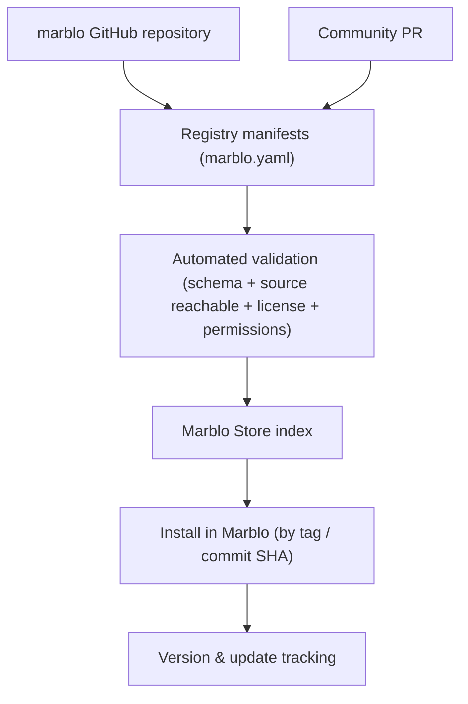

# Marblo Ecosystem — Plan & Roadmap

> The public `marblo` repository is the **home of Marblo's open ecosystem**: a community-driven Store of skills, MCP servers, agents, workflows, and knowledge packs you can install into the Marblo app. This document is the plan for turning it into a repo the community stars, searches, and contributes to.

## 1. Goal

Concentrate the public ecosystem — stars, search, PRs, Issues, discussion — in **one representative repo**, and wire it directly to the **Marblo Store** so that browsing on GitHub and installing in the app are the same catalog.

Not a warehouse that copies everything in. An **install-and-run monorepo**: every item is either first-party code we maintain, or an external item referenced by a pinned manifest.

**North-star outcome:** a developer lands on the repo, sees real installable assets and a killer bundle, stars it, installs a bundle into Marblo in one click, and later opens a PR to add their own skill.

## 2. Why one repo (the star strategy)

Community attention compounds where it lands. Split the ecosystem across `marblo-skills`, `marblo-mcp`, `marblo-agents` too early and every repo starts from zero. Peers that win developer mindshare (e.g. Orca-style worktree/agent tooling) do it by making **one** repo the obvious place to look, star, and contribute.

Stars are earned by **usable + documented + demonstrated**, not by folder structure. So the repo must ship, from day one:

- Real, installable items in every category — no empty folders (empty reads as vaporware).
- A flagship **Bundle** that assembles a working team in one install.
- Docs that get someone productive fast, and runnable **examples**.
- A low-friction, safe path for the community to add their own items.

## 3. Architecture — repo ↔ Store

- **GitHub repo = public source of truth.** The Marblo app reads `registry/` to build the Store; installs pin a tag or commit SHA.
- **First-party items keep real code here.** Referenced (external) items are **manifest-only** — no vendoring, so license, security patching, and ownership stay upstream. See [SECURITY.md](SECURITY.md).
- **Tiers:** `official` (Marblo-maintained) · `verified` (external, reviewed, pinned) · `community` (external, unreviewed).
- **Categories:** harnesses · skills · mcp-servers · agents · workflows · knowledge-packs · **bundles**. A bundle is a manifest that installs several items together — the strongest product unit (e.g. a "Next.js SaaS Team Bundle" = harness + agents + reviewer skill + GitHub MCP + knowledge pack).

## 4. Community contribution model

Open source means users extend the Store. The path is designed to be **safe by default**:

1. Contributor opens a PR adding a `marblo.yaml` (+ real files for first-party, or a pinned `source` for referenced).
2. **CI validates**: schema, unique `id`, source reachable at the pinned ref, license present, declared `permissions`.
3. Merged items enter as **`community`** tier. Maintainers promote to **`verified`** after review.
4. The app surfaces `tier` and `permissions` before install, so users judge trust themselves.

Governance stays light: Issues for proposals, PRs for items, `CODEOWNERS` for the registry, and a short review checklist. Model weights, datasets, secrets, and copied third-party docs are out of scope (see [CONTRIBUTING.md](CONTRIBUTING.md)).

## 5. Roadmap

### Phase 0 — Foundation (this repo, now)

Repo structure, `registry/manifest.schema.json`, docs skeleton, root governance files, and **one real item per category** (a skill, two MCP manifests, an agent, a workflow, a knowledge pack). Deliverable: a non-empty, star-worthy, install-ready foundation — even before the app UI lands, with manual install docs.

### Phase 1 — App consumes the registry

Extend the Marblo **Harness Store** (today a built-in CLI/MCP installer) to fetch this registry, validate manifests, and install skills/agents/workflows/knowledge/bundles by tag/SHA. Ship `packages/registry-validator` and wire it into CI. Deliverable: "Install in Marblo" is real.

### Phase 2 — CLI, SDK, Bundles, community tooling

`packages/marblo-cli` (search/install from a terminal), `packages/extension-sdk`, the first official **Bundles**, and community moderation tooling (tier promotion, Issue templates, contribution dashboard).

### Phase 3 — Split only when it hurts

Keep everything in `marblo` until a category has hundreds of files, needs its own release cadence or maintainer, or external PR volume is unmanageable. Then split (`marblo-skills`, `marblo-mcp`, `marblo-sdk`) while `marblo` keeps **indexing the whole ecosystem**.

## 6. Boundaries

| Public `marblo-app/marblo`                                                                                       | Private (product)            |
| ---------------------------------------------------------------------------------------------------------------- | ---------------------------- |
| Homepage · Docs · Store Registry · first-party skills/MCP/agents/workflows/knowledge · examples · public tooling | Marblo app & core technology |

**Never here:** model weights, large datasets, secrets/keys, copied external code or docs of unclear provenance.

## 7. Success signals

Stars & watchers · Store installs per item · community PRs merged (and community→verified promotions) · bundles published · time-to-first-install for a new developer.

---

_This is a living plan (v0 preview). Milestones and dates land in Issues/Projects as phases start._
