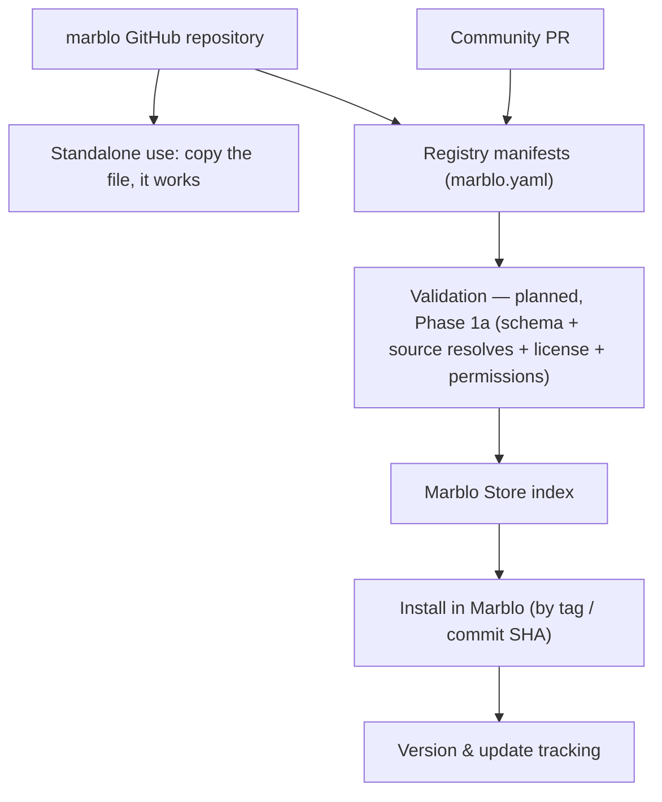

# Marblo Ecosystem — Plan & Roadmap

> The public `marblo` repository is the **home of Marblo's open ecosystem**: harness-neutral skills, agents, workflows, MCP manifests, and knowledge packs that work in the agent CLI you already run — and that Marblo can install for you in one click if you want it to. This document is the plan for making that repo genuinely useful on its own.

## 1. Goal

**North star:** a developer lands on this repo, copies one asset into `~/.claude/skills/` or `~/.codex/skills/`, and it works in their next session — **without installing anything of ours.** Some of those developers later discover they have the multi-agent problem Marblo solves, and install the app. The Store is the upgrade path, not the toll gate.

That ordering is the whole strategy. It changes what every asset must be:

- Every first-party item ships as a **plain, standards-native artifact** — a `SKILL.md`, an agent definition in the format Claude Code and Codex already read, an MCP manifest any MCP client can use, a knowledge pack that is just markdown.
- `marblo.yaml` is **additive Store metadata, not a container.** Delete it and the asset still works.
- "Install in Marblo" is a convenience layered on top: one click, version tracking, and updates.

The secondary goal is the original one — concentrate stars, search, PRs, and discussion in **one** repo rather than splitting across `marblo-skills` / `marblo-mcp` / `marblo-agents` before any of them has readers.

## 2. Why this shape (and what we are benchmarking against)

Repos in this space earn attention through one of two very different mechanisms, and confusing them leads to the wrong roadmap.

**A vendor catalog** — a store repo attached to a closed product — is driven by that product's installed base. It is a _contribution_ surface: people fork it to submit, they do not star it to follow. Well-executed examples of this shape sit in the hundreds-to-single-digit-thousands of stars after four or five years, and their star counts track the product's, not their own merit.

**A harness-neutral content repo** needs no product at all. The peer set, and what we are actually benchmarking against:

| Repo                                      | What it ships                     |
| ----------------------------------------- | --------------------------------- |
| `anthropics/skills`                       | Skills, portable, no app required |
| `modelcontextprotocol/servers`            | MCP servers                       |
| `punkpeye/awesome-mcp-servers`            | MCP server index                  |
| `hesreallyhim/awesome-claude-code`        | Skills, commands, workflows       |
| `wshobson/agents`                         | Agent definitions                 |
| `VoltAgent/awesome-claude-code-subagents` | Subagent definitions              |

Every one of them reached tens of thousands of stars in **under a year**, and every one ships the exact content types this repo already contains. What separates them from a vendor catalog is not folder structure — it is that **none of them requires a vendor app to be useful.**

So we are not chasing "an open-source agent IDE" as a peer. That comparison is not available to us by construction: those projects earn their following by giving away the product itself, and Marblo's orchestration engine is closed (see §6). Inviting the comparison anyway reads, correctly, as asking for unpaid channel development.

What we are doing instead: ship assets that stand on their own, be explicit about where the closed line is, and let the app be the upgrade for the people who need it. **The same files, pointed at a different lane.**

Stars follow **usable + documented + demonstrated**. So the repo must ship:

- Assets that work standalone, each with a copy-paste install snippet for the CLI the reader already has.
- At least one asset that is **non-substitutable** — something nobody else can write. Today that is the [Fleet Operations](knowledge/fleet-operations/) pack: production knowledge from running several vendor agent CLIs in parallel for months. It is a byproduct of operating the fleet, not a writing exercise, which is exactly why it cannot be cloned.
- Docs that get someone productive fast.
- A safe, low-friction path for the community to add their own.

## 3. Architecture — repo ↔ Store

- **The asset is the product; the manifest is metadata.** The left branch — copy the file, use it — is the primary path and requires nothing from us.
- **GitHub repo = public source of truth.** The Marblo app reads the registry to build the Store; installs pin a tag or commit SHA.
- **First-party items keep real code here.** Referenced (external) items are **manifest-only** — no vendoring, so license and ownership stay upstream. See [SECURITY.md](SECURITY.md).
- **Tiers:** `official` (Marblo-maintained) · `verified` (external, reviewed, pinned) · `community` (external, listed, not reviewed). Today tier is self-asserted in the manifest and enforced only by human review at merge; Phase 1a moves derivation into CI.
- **Categories:** harnesses · skills · mcp-servers · agents · workflows · knowledge-packs · bundles.

## 4. Community contribution model

Open source means users extend the ecosystem. Until the app ships a permission gate and a review workflow, the path is deliberately narrow:

1. Contributor opens a PR adding a `marblo.yaml` (+ real files for first-party, or a pinned `source` for referenced).
2. A maintainer reviews it by hand. **CI validation does not exist yet** — it is Phase 1a. Until then, review _is_ the control, and the merge is the trust event.
3. Merged community items are **listings: discoverable and linkable, not installable.** The app will not one-click-install a `community`-tier item.
4. Promotion to `verified` follows a maintainer review of the actual payload, and is a maintainer-side change — not an edit to the contributor's own manifest.

**Why listings and not installs.** A skill or knowledge pack is prose that gets loaded into an agent that holds shell access and repository write. Pinning a commit proves the file did not change after review; it proves nothing about whether the file is safe. For text-payload items **review is the control, and pinning is not a substitute for it.** Shipping one-click installs of unreviewed community text would be promising a safety property we cannot deliver. See [SECURITY.md](SECURITY.md).

Governance stays light: Issues for proposals, PRs for items, `CODEOWNERS` for every registry path, and a short review checklist. Model weights, datasets, secrets, and copied third-party docs are out of scope (see [CONTRIBUTING.md](CONTRIBUTING.md)).

## 5. Roadmap

### Phase 0 — Foundation (this repo, now)

Repo structure, `registry/manifest.schema.json`, docs skeleton, governance files, and real items across categories — each usable standalone, each with an install snippet. Deliverable: **a repo that is useful with no app installed.**

### Phase 1a — Honest controls, then two item types end to end

Ordered so that nothing claims a guarantee it does not have:

1. **Documentation matches reality** — every claimed control either exists or is labeled as planned. (Done in this pass.)
2. **`packages/registry-validator`** — public, runnable locally by contributors _before_ they open a PR, wired into CI. The validator is the public specification of the install contract.
3. **Schema hardening** — required `permissions` for executable types, required pinned `source` for anything not first-party, `status: active | deprecated | revoked`. (Done in this pass; CI-derived tier follows with the validator.)
4. **Signed, immutable index** built by CI, plus a revocation list the app can act on.
5. **App-side:** read-only Store browsing → install for `skill` and `mcp-server` only, with a permission-disclosure gate, an install ledger, and uninstall.
6. **Revocation kill switch** — a revoked item already on disk prompts for removal.

Two item types, end to end, is the whole of 1a. That is deliberate: they are the two the installer already understands, and they exercise the entire pipeline (fetch → verify → disclose → install → ledger → update → uninstall).

### Phase 1b — The remaining item types

`agent`, `workflow`, `knowledge-pack`, then `bundle` last — a bundle is only as safe as the resolution of the things it includes.

### Phase 2 — CLI, SDK, Bundles, community tooling

`packages/marblo-cli`, `packages/extension-sdk`, the first official **Bundles**, and community moderation tooling. Deferred until the registry has readers and real items; building an SDK before that is designing for imagined users.

### Phase 3 — Split only when it hurts

Keep everything in `marblo` until a category has hundreds of files, needs its own release cadence or maintainer, or external PR volume is unmanageable. Then split while `marblo` keeps **indexing the whole ecosystem**.

## 6. Boundaries

| Public `marblo-app/marblo`                                                                                 | Private (product)                 |
| ---------------------------------------------------------------------------------------------------------- | --------------------------------- |
| Docs · Store registry · first-party skills/agents/workflows/MCP manifests/knowledge packs · public tooling | Marblo app & orchestration engine |

**The line, stated plainly:** the orchestration engine — live orchestration, the board, worktree isolation, cost attribution, safe merge — is the closed, paid product. Everything the agents _consume_ is open, portable, and works with or without Marblo.

**Never here:** model weights, large datasets, secrets/keys, copied external code or docs of unclear provenance.

## 7. Success signals

Only signals that can actually be read today, or that name the instrumentation they need. A metric nobody can measure gets quietly replaced by star count — which is the proxy trap this whole plan is about.

**Observable now** (GitHub Insights, no instrumentation required):

| Signal                                       | Where it is read              | Why it matters                                                                                                                      |
| -------------------------------------------- | ----------------------------- | ----------------------------------------------------------------------------------------------------------------------------------- |
| Unique visitors & page views (14-day window) | Repo → Insights → Traffic     | Are there readers at all? This is the Phase 0 gate.                                                                                 |
| Clones (unique cloners)                      | Repo → Insights → Traffic     | Someone took the assets. Closest proxy to standalone install.                                                                       |
| Referring sites                              | Repo → Insights → Traffic     | Whether anything is being shared outward.                                                                                           |
| Issues & PRs opened by non-maintainers       | Repo → Issues / Pull requests | Real external engagement, unlike stars.                                                                                             |
| Stars & forks                                | Repo header                   | Tracked, explicitly **not** optimized for. Forks exceeding stars means the repo reads as a contribution surface, not a content one. |

**Needs instrumentation, not a signal until it exists:**

| Signal                     | Blocked on                                                                       |
| -------------------------- | -------------------------------------------------------------------------------- |
| Store installs per item    | Phase 1a install ledger + app-side telemetry. Not measurable today; not claimed. |
| Time-to-first-useful-asset | A timed manual walkthrough (fresh machine, no app) — run it, record the number.  |

**Explicitly not a target:** matching the star count of projects whose product _is_ the repository. See §2.

---

_This is a living plan (v0 preview). Milestones and dates land in Issues/Projects as phases start._
