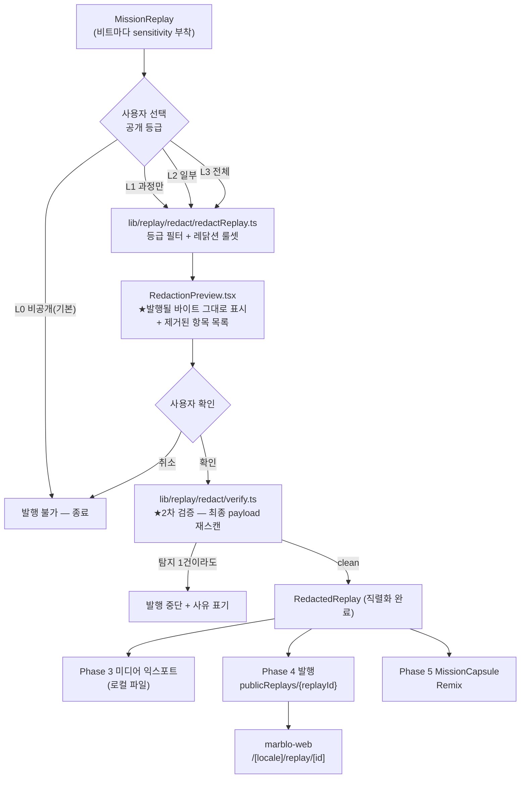
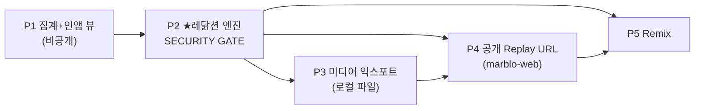
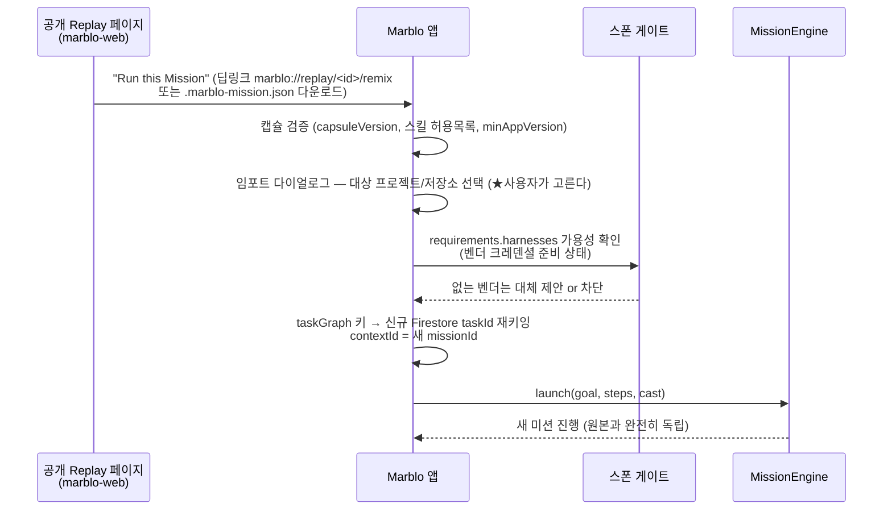

# Mission Replay — 설계 문서

**Status:** Draft for review (Phase 1 착수 판단용)
**Ticket:** `pufIv1ofrk5vD6AgaYZ3` (에픽)
**Date:** 2026-08-01
**Scope:** 설계만. 이 문서에는 구현 코드가 없다.
**관련 스펙:** `v3/docs/MISSIONS-SPEC.md`, `v3/docs/MISSIONS-B-ORCHESTRATOR-DRIVEN.md`

> 배치 메모: 이 문서는 지시대로 저장소 루트 `docs/` 에 둔다. v3 엔지니어링 스펙은
> 통상 `v3/docs/` 에 있으므로, 구현 착수 시 `v3/docs/MISSIONS-SPEC.md` 에서 이 문서로
> 상호 참조 링크를 걸어 둘 것.

---

## 0. 한 줄 요약

**Mission Replay** = 완료된 미션을 자동으로 "공유 가능한 콘텐츠"(요약·타임라인·GIF/영상·카드)로
만들어 SNS/GitHub 에 공유하고, 그것을 본 사람이 **Remix** 로 같은 미션을 자기 프로젝트에
복제하는 바이럴 루프. 제품 서사는 **Build → Orchestrate → Replay → Remix**.

핵심 가치는 "기록을 볼 수 있다"가 아니다. **"쓸 때마다 공유 가능한 콘텐츠가 저절로 생긴다"** 이다.
사용자가 별도 노력(스크린샷 찍기, 글 쓰기)을 들이지 않아야 한다.

그리고 이 기능의 전제 조건은 하나다: **Private-first.** 회사 프로젝트에서 돌린 미션의
로컬 경로·유저명·API 키·코드가 실수로라도 공개되면 이 기능은 제품 자산이 아니라 사고다.
그래서 레닭션(Phase 2)이 모든 공개·익스포트의 **선행 게이트**다.

---

## 1. 배치 — 어디에 만드는가 (사장님 확정)

Replay 뷰는 **완료이력 탭**(`v3/src/components/work-history/`)에 만든다. 신규 탭을 만들지 않는다.

근거(실제 코드 확인):

| 이미 있는 것                                       | 파일                                    | Replay 와의 관계                    |
| -------------------------------------------------- | --------------------------------------- | ----------------------------------- |
| 완료(DONE) 태스크 리스트 + 완료보고 파싱           | `work-history/WorkHistoryTab.tsx`       | Replay 의 태스크 레인이 이미 여기   |
| "Shipped with Marblo" 공유카드                     | `work-history/ShareCard.tsx`            | Phase 3 미디어 익스포트가 이걸 흡수 |
| 기간·역할·검색 필터                                | `work-history/WorkHistoryFilterBar.tsx` | Replay 리스트에 그대로 재사용       |
| 집계 순수함수 `computeShareStats`                  | `src/lib/shareCard.ts`                  | Replay 통계 타일의 씨앗             |
| 완료보고 파서(`problem/approach/changes/…`)        | `src/lib/completionReport.ts`           | Replay 타임라인의 서사 문장         |
| 머지 diff 좌표(`repoRoot`/`headSha`) + 비식별 수치 | `src/services/mergeHistoryService.ts`   | Replay 의 "코드 성과" 수치          |

즉 "완료된 일을 보여주는 집"이 이미 있고, Replay 는 그 집의 **미션 단위 뷰**다.
태스크 단위(기존) ↔ 미션 단위(신규)를 같은 탭 안에서 토글한다.

### 1.1 컴포넌트 트리 (Phase 1~2 기준)

```
v3/src/components/work-history/
├ WorkHistoryTab.tsx              # (수정) 뷰 토글: [태스크] | [미션 Replay]
├ ShareCard.tsx                   # (기존 유지)
├ WorkHistoryFilterBar.tsx        # (기존 재사용)
└ replay/                         # ★ 신규
   ├ MissionReplayList.tsx        # 완료 미션 카드 리스트 (P1)
   ├ MissionReplayDetail.tsx      # 단일 Replay 상세 (P1)
   ├ ReplayHeadline.tsx           # goal·템플릿·소요시간·결과 (P1)
   ├ ReplayStatsGrid.tsx          # 통계 타일 (P1)
   ├ ReplayTimeline.tsx           # 레인별 비트(beat) 타임라인 (P1)
   ├ ReplayBeatRow.tsx            # 비트 1행 + 민감도 뱃지 (P1)
   ├ ReplayCast.tsx               # 에이전트별 기여 (P1)
   ├ ReplayVisibilityPanel.tsx    # 공개 3단계 선택 (P2)
   ├ RedactionPreview.tsx         # ★공개될 원문 그대로 프리뷰 (P2)
   └ ReplayExportPanel.tsx        # GIF/영상/카드/배지 (P3)

v3/src/lib/replay/                # ★ 순수 로직 (I/O 없음 = 단위테스트 전수)
├ missionReplay.ts                # 소스 → MissionReplay 집계 (P1)
├ beats.ts                        # 소스별 → ReplayBeat 매퍼 (P1)
├ sensitivity.ts                  # 비트 민감도 분류 (default-deny) (P1)
└ redact/                         # (P2)
   ├ patterns.ts                  # 시크릿·PII 정규식 (scrub.ts 확장)
   ├ entropy.ts                   # Shannon 엔트로피 탐지
   ├ rules.ts                     # 규칙표 → 실행 가능한 룰셋
   ├ redactReplay.ts              # MissionReplay → RedactedReplay
   └ verify.ts                    # ★2차 검증(발행 직전 재스캔)

v3/src/hooks/useMissionReplay.ts          # 구독 + 집계 조립
v3/src/services/missionReplayService.ts   # Firestore 구독 (읽기 전용)
```

**설계 원칙:** 집계·분류·레닭션은 전부 `lib/` 의 **순수 함수**로 둔다. 컴포넌트는 렌더만 한다.
이유는 두 가지다 — (a) 레닭션은 보안 경계라 단위 테스트로 전수 검증해야 하고
(`tests/telemetry/scrub.test.mjs` 가 이미 그 선례), (b) Phase 3~5(익스포트·발행·Remix)가
같은 순수 함수를 재사용해야 UI 경로와 발행 경로의 레닭션 결과가 어긋나지 않는다.

> ★ 레닭션이 UI 에만 있고 발행 경로에 없으면, 화면에는 가려져 보이는데 업로드되는 바이트에는
> 원문이 남는 실패가 난다. 이건 이 기능에서 가장 치명적인 버그 형태다. **하나의 순수 함수를
> 두 경로가 공유**하는 구조로 이 실패를 구조적으로 막는다.

---

## 2. 데이터 모델

### 2.1 'Mission' 을 무엇으로 키잉하나

**답: `missions/{missionId}` 문서 1건이 Replay 1건이다.** 새 키를 만들지 않는다.

이미 존재하는 것(실측):

- 컬렉션: `missions` (`v3/electron/mission-engine/store-impl.ts` `const COLLECTION = "missions"`)
- 스키마: `v3/src/types/mission.ts` `Mission`
  - `id, projectId, goal, templateId, status, ownerOrchestratorSessionId`
  - `steps: MissionStep[]`, `currentStepIndex`, `taskIds: string[]`, `contextLog: TimelineEvent[]`
  - `targetRepository?`, `targetBranch?`, `targetAccessMode?`
  - `missionCardTaskId?` (대표 보드 카드)
  - `launchedAt`, `lastActivityAt`, `completedAt`, `abandonedReason?`

**Replay 대상 = `status === "completed"` 인 미션.** (`abandoned` 는 Phase 1 에서 리스트에
회색으로 노출하되 익스포트 대상 아님 — "실패도 콘텐츠"는 Phase 3 이후 별도 판단.)

#### 암묵적 미션 (implicit mission) — ad-hoc 보드 작업도 Replay 로 (P1-4, 사장님 확정)

실사용의 대부분은 명시적 미션 런치가 아니라 **ad-hoc 보드 티켓**이다(`contextId = "board"`).
그것들이 Replay 로 안 잡히면 이 기능은 텅 빈 화면이 되고 "쓸 때마다 공유 콘텐츠가 저절로
생긴다"는 전제가 무너진다.

그래서 미션의 정의를 하나 넓힌다:

> **암묵적 미션** = 오케스트레이터가 **dispatch 시점에** 서로 연관된 ad-hoc 티켓 묶음에
> 부여한 **라벨**. 실행 계획(`steps`)이 없는 가벼운 `missions/{id}` 문서 1건이며,
> `missionKind: "implicit"` / `templateId: "adhoc"` / `implicitLabel: <라벨>` 로 식별된다.

★**새 그룹핑 경로를 만들지 않는다.** 라벨이 붙는 순간 그 티켓들의 `contextId` 가 해당
`missionId` 로 바뀌고, 그러면 위의 1급 조인키(`tasks.contextId === missionId`)가 그대로
성립한다 — P1-1(집계)·P1-2(구독)·P1-3(뷰)는 **한 줄도 바뀌지 않는다.**

| 축                 | 규칙                                                                                                                                                          |
| ------------------ | ------------------------------------------------------------------------------------------------------------------------------------------------------------- |
| 경계를 누가 정하나 | **오케**. `create_task` / `create_tasks_bulk` / `dispatch_task` 의 `mission_label`(+ 최초 1회 `mission_goal`). 사장님 지시 1건 = 라벨 1개                     |
| 합류               | 같은 프로젝트에서 같은 라벨의 **열린**(planning/active/waiting_for_human/sleeping) 암묵적 미션이 있으면 거기 합류, 없으면 새로 생성                           |
| 마감               | 소속 티켓이 **전부 종단(DONE/FAILED)이고 DONE 이 1건 이상**이면 자동으로 `completed` + `completedAt`. 그 순간 Replay 에 뜬다                                  |
| 라벨 재사용        | 끝난 묶음에는 합류하지 않는다 → 같은 라벨을 다시 써도 새 미션. **발행된 Replay 에 뒤늦은 티켓이 섞이지 않는다**                                               |
| 입양 대상          | **보드 티켓만**(`contextId` 가 `"board"` 이거나 미설정). Quick Lane(`lane:*`)·명시적 미션 소속 티켓은 **거부**(레인 격리·미션 소속은 회귀 금지)               |
| 엔진               | **엔진이 절대 구동하지 않는다.** `missionKind: "implicit"` 마커로 `wire.ts`(부팅 in-flight 복구 / planning 구독)와 `event-forwarder`(활성 미션 집계)에서 제외 |
| 미션 탭            | 목록에서 제외한다. 진행바·일시정지·재실행이 무의미한 0-스텝 카드가 되기 때문. 이 묶음이 보이는 곳은 **완료이력 탭의 Replay** 다                               |

**왜 시간·세션으로 안 묶나.** "최근 N분 안의 보드 티켓"류 기계적 시간묶기는 서로 무관한 두
지시를 한 Replay 로 붙이고 하나의 지시를 점심시간에 둘로 쪼갠다. 오케 세션 id 로 묶는 것은
바로 위 "왜 오케 세션이 아니라 미션 문서인가"가 이미 배제했다(세션은 재시작되고, 한 세션이
여러 묶음을 병렬로 굴린다). 어느 티켓들이 한 덩어리인지는 **오케만 아는 사실**이고, 기계가
추측할 자리가 아니다.

**라벨이 안 붙은 잔여 보드 티켓은 그대로 둔다.** 억지 '미분류' 미션을 만들면 수백 티켓짜리
쓰레기통 Replay 1건이 생길 뿐이다. 라벨 없는 티켓은 보드에 남고 Replay 에 안 뜬다 —
정직한 빈칸이지 결함이 아니다. 사후에 묶고 싶으면 그 티켓을 라벨과 함께 다시 dispatch 하면
된다(이미 있는 보드 티켓도 입양된다).

구현: `v3/electron/mcp-server/implicit-mission.ts`(규칙 전부 — 순수 함수) + `tools.ts`(I/O).
계약 테스트: `v3/tests/unit/mission-implicit-grouping.test.ts`.

#### 왜 오케 세션이 아니라 미션 문서인가

`ownerOrchestratorSessionId` 로 키잉하지 않는 이유:

1. 오케 PTY 세션은 재시작된다(auto-restart). 세션 id 가 바뀌어도 미션은 계속된다 —
   `MISSIONS-SPEC.md §12` 의 테스트 시나리오가 이미 이 재연결을 요구한다.
2. 한 오케 세션이 **여러 미션**을 병렬로 돌린다(같은 스펙 §12 "동시 multiple missions").
3. 미션 문서에는 `launchedAt`/`completedAt` 이라는 명확한 시작·종료 경계가 있다.
   세션에는 없다.

#### 미션에 속한 이벤트를 어떻게 모으나 — 조인 키

```
missions/{missionId}
   ├─ .contextLog[]                       (내장: 오케 서사)
   ├─ .taskIds[]  ──┐
   └─ .projection   │
                    ├──▶ tasks where contextId == missionId      (★1급 조인키)
                    │      └─ activities/*  (완료보고)
                    ├──▶ audit_logs where taskId in taskIds      (AI 행위)
                    ├──▶ projectAuditLog where taskId in taskIds (사람 행위)
                    └──▶ merge_history where taskId in taskIds   (코드 성과)
```

- **1급 조인키는 `tasks.contextId === missionId`** 다. `MISSIONS-SPEC.md §6.6-A` 가 못 박은
  규약이고(`dispatcher-impl.ts` 가 `contextId: input.missionId` 로 쓴다), `laneContext.ts` 의
  `isMissionTask()` / `getMissionId()` 가 이미 판별 유틸을 제공한다.
  `mission.taskIds[]` 는 보조 인덱스로만 쓴다 — 배열이라 드리프트 가능성이 있고,
  `contextId` 쪽이 태스크 문서에 직접 박힌 사실이다.
- **`audit_logs`·`projectAuditLog`·`merge_history` 는 전부 `taskId` 로만 미션에 붙는다.**
  세 컬렉션 어디에도 `missionId` 필드가 없다(실측). 이건 제약이지 버그가 아니다 — 아래 §2.4.

### 2.2 파생 타입: `MissionReplay` (신규, 저장 안 함)

Phase 1 에서는 **Firestore 에 아무것도 새로 쓰지 않는다.** `MissionReplay` 는 구독 중인
데이터에서 클라이언트가 조립하는 파생 뷰 모델이다(= `computeShareStats` 와 같은 성격).

```ts
// v3/src/types/missionReplay.ts (신규 타입 파일 — Phase 1)

/** 이 비트가 어느 층에서 일어난 일인가. UI 레인 + 레닭션 분류의 1급 축. */
export type ReplayLane = "human" | "orchestrator" | "agent" | "system";

/** 공개 등급. 낮을수록 안전. 기본값은 항상 "private". */
export type ReplaySensitivity =
  | "private" // 절대 밖으로 안 나감 (기본값)
  | "process" // "무엇을 했는가"만 — 단계명·상태전이·수치
  | "summary" // + 요약 문장·PR 링크·파일 수
  | "detail"; // + 코드/터미널 발췌 (사용자가 명시 동의한 경우만)

export interface ReplayBeat {
  /** 결정적 id — (source, sourceId) 해시. 재집계해도 같은 비트는 같은 id. */
  id: string;
  ts: Date;
  lane: ReplayLane;
  /** 소스 출처. 프로버넌스 표기 + 디버깅용. */
  source:
    | "mission.contextLog"
    | "task"
    | "task.activity"
    | "audit_logs"
    | "projectAuditLog"
    | "merge_history";
  kind: string; // 소스별 원 타입 (예: "step.completed", "task.status_changed")
  taskId: string | null;
  agentRef: string | null; // 익명화된 에이전트 별칭 (예: "agent-1 · claude")
  actorRef: string | null; // 익명화된 사람 별칭 (예: "member-1")
  title: string; // 한 줄 서사
  detail?: string; // 확장 시 본문
  /** ★분류는 집계 시점에 붙는다. 발행 시점에 뒤늦게 정하지 않는다. */
  sensitivity: ReplaySensitivity;
}

export interface ReplayCastMember {
  agentRef: string; // 익명 별칭
  vendor: string; // agents.model (claude/gpt/grok/…)
  spawnedModel: string | null; // agents.spawnedModel
  detectedModelId: string | null; // agents.detectedModelId (과금 관측)
  role: string;
  tasksCompleted: number;
  beats: number;
}

export interface ReplayStats {
  tasks: number;
  tasksDone: number;
  agents: number;
  prs: number;
  filesChanged: number; // merge_history.filesChanged 합
  linesAdded: number;
  linesDeleted: number;
  testsPassed: number; // computeShareStats 재사용
  riskFlags: number;
  retries: number; // task.retriesCount 합
  durationMs: number;
  /** 비용은 기본 private. 공개 등급에서 별도 opt-in. */
  costTotal: number | null;
}

export interface MissionReplay {
  replayVersion: 1;
  missionId: string;
  projectId: string;
  goal: string;
  templateId: string;
  launchedAt: Date;
  completedAt: Date | null;
  stats: ReplayStats;
  cast: ReplayCastMember[];
  beats: ReplayBeat[]; // ts 오름차순
  prUrls: string[];
  /** 어떤 소스가 실제로 읽혔는지 — 권한 부족으로 빠진 레인을 UI 가 정직하게 표시. */
  provenance: {
    sources: Record<string, "ok" | "denied" | "empty">;
    generatedAt: Date;
  };
}
```

### 2.3 Replay 섹션 ↔ 기존 소스 매핑 (신규 계측 최소화)

| Replay 섹션      | 화면 요소                  | 소스 (실측)                                                               | 조인 키                    | 신규 계측 |
| ---------------- | -------------------------- | ------------------------------------------------------------------------- | -------------------------- | --------- |
| 헤드라인         | goal·템플릿·기간·결과      | `missions/{id}` doc                                                       | 문서 자체                  | **없음**  |
| 진행 서사 (오케) | 타임라인 orchestrator 레인 | `mission.contextLog[]` (`TimelineEvent`)                                  | 내장 배열                  | **없음**  |
| 단계 진행        | 스텝 진행바                | `mission.steps[]` (`status`/`startedAt`/`completedAt`)                    | 내장 배열                  | **없음**  |
| 태스크 진척      | 타임라인 agent 레인        | `tasks` where `contextId == missionId`                                    | `contextId`                | **없음**  |
| 태스크 요약 문장 | 비트 본문                  | `tasks/{id}/activities` → `parseCompletionReport`                         | task 서브컬렉션            | **없음**  |
| 에이전트 캐스트  | 에이전트별 기여            | `agents` (`model`/`spawnedModel`/`detectedModelId`) + `task.claimedBy`    | `agentId`                  | **없음**  |
| AI 행위 상세     | 타임라인 agent 레인(심층)  | `audit_logs` (`toolName`/`model`/`tier`/`success`/`duration`)             | `taskId ∈ mission.taskIds` | **없음**  |
| 사람 행위        | 타임라인 human 레인        | `projectAuditLog` (`type`/`actorUid`/`actorName`)                         | `taskId ∈ mission.taskIds` | **없음**  |
| 코드 성과        | 통계 타일                  | `merge_history` (`filesChanged`/`linesAdded`/`linesDeleted`/`changeType`) | `taskId`                   | **없음**  |
| PR               | 링크 칩                    | `task.prUrl` + 완료보고 `pr` 필드                                         | task                       | **없음**  |
| 비용·재시도      | 통계 타일(기본 비공개)     | `task.costTotal`/`retriesCount`, `agent.totalCost`                        | rollup 필드                | **없음**  |
| 현재 상태 요약   | 카드 뱃지                  | `tasks/{id}.projection`, `missions/{id}.projection`                       | nested map                 | **없음**  |

**결론: Phase 1 은 신규 계측 0.** 데이터 substrate 는 이미 존재한다. 신규는 **집계 + 뷰 계층**뿐이다.

`merge_history` 가 이미 `filesChanged`/`linesAdded`/`linesDeleted` 를 **비식별 수치로** 들고 있는
것이 특히 중요하다 — Replay 의 "코드 성과" 타일을 **원본 diff 를 한 번도 읽지 않고** 채울 수 있다.
공개 가능한 수치와 공개 불가한 원문이 이미 소스에서 분리돼 있다는 뜻이다.

### 2.4 알려진 제약 — 설계에 반영해야 할 것

| #   | 제약 (실측)                                                                                      | 영향                                                          | 이 설계의 대응                                                                                          |
| --- | ------------------------------------------------------------------------------------------------ | ------------------------------------------------------------- | ------------------------------------------------------------------------------------------------------- |
| C1  | `audit_logs` 에 `missionId` 필드가 없다 (`ledger.ts` `LedgerEvent`)                              | 오케 자신이 부른 툴(=`taskId` null)은 미션에 귀속 안 됨       | 그 구간은 `mission.contextLog` 가 이미 커버. **원장 스키마는 건드리지 않는다**(불변 원장 변경은 비싸다) |
| C2  | `projectAuditLog` read = **owner/admin 전용** (`projectAudit.ts` 주석)                           | 일반 멤버 화면에서 human 레인이 통째로 빈다                   | `provenance.sources.projectAuditLog = "denied"` 로 표기하고 레인을 **숨긴다**(빈 레인 ≠ 행위 없음)      |
| C3  | `mission.contextLog` 는 단일 문서 내장 배열, 상한 없이 append (`store-impl.appendTimelineEvent`) | 장기 미션에서 Firestore 1MB 문서 한도 근접 → 미션 자체가 죽음 | Replay 는 contextLog **단독 의존 금지**. 리스크로 별도 등재(§8 R3) — 상한/롤오버는 별개 티켓            |
| C4  | `ProjectAuditMetadata` 는 스칼라만 (중첩 금지)                                                   | human 레인 비트 본문이 빈약                                   | 의도된 설계다(원장에 본문 박제 금지). Replay 도 같은 원칙 유지 — 본문 대신 타입·대상 id 만              |
| C5  | `audit_logs.instructionHash` 는 해시만, 원문 없음                                                | "무슨 지시를 줬는가"를 Replay 가 못 보여줌                    | 그대로 유지. 공개 콘텐츠에 지시문 원문이 없는 건 **기능이지 결함이 아니다**                             |
| C6  | `tasks.scope[]` 는 저장소 상대 경로지만 사용자가 절대 경로를 넣었을 수 있음                      | 로컬 경로 유출 경로                                           | 레닭션 R1 이 절대 경로를 잡고, 잡히면 그 항목을 **드롭**(마스킹 아님)                                   |

---

## 3. 데이터 흐름

### 3.1 Phase 1 (인앱, 비공개)

```mermaid
flowchart LR
  subgraph FS["Firestore (기존 — 신규 write 없음)"]
    M["missions/{id}<br/>contextLog·steps·taskIds"]
    T["tasks<br/>contextId == missionId"]
    A["tasks/*/activities<br/>완료보고"]
    L["audit_logs<br/>taskId 조인"]
    P["projectAuditLog<br/>owner/admin only"]
    G["merge_history<br/>filesChanged/lines"]
  end

  FS --> S["missionReplayService.ts<br/>(구독 · 읽기 전용)"]
  S --> B["lib/replay/beats.ts<br/>소스 → ReplayBeat"]
  B --> C["lib/replay/sensitivity.ts<br/>★분류 (default = private)"]
  C --> R["lib/replay/missionReplay.ts<br/>집계 → MissionReplay"]
  R --> U["hooks/useMissionReplay.ts"]
  U --> V["work-history/replay/*.tsx<br/>인앱 뷰 (전부 로컬)"]
```



### 3.2 Phase 2~4 (레닭션 → 익스포트 → 발행)



---

## 4. 5단계 로드맵 + 의존



**불변식: P2 를 통과하지 않은 바이트는 앱 밖으로 한 바이트도 나가지 않는다.**
P3(로컬 파일 저장)조차 P2 뒤에 둔 이유 — 로컬 GIF 는 사용자가 곧바로 드래그해서 슬랙·트위터에
올린다. "로컬이라 안전"은 이 기능에선 성립하지 않는다.

### Phase 1 — 집계 + 비공개 인앱 Replay 뷰

| 항목      | 내용                                                                                                                                                                                                                                                                                                                 |
| --------- | -------------------------------------------------------------------------------------------------------------------------------------------------------------------------------------------------------------------------------------------------------------------------------------------------------------------- |
| 산출물    | `types/missionReplay.ts`, `lib/replay/{missionReplay,beats,sensitivity}.ts`, `services/missionReplayService.ts`, `hooks/useMissionReplay.ts`, `work-history/replay/{MissionReplayList,MissionReplayDetail,ReplayHeadline,ReplayStatsGrid,ReplayTimeline,ReplayBeatRow,ReplayCast}.tsx`, `WorkHistoryTab.tsx` 뷰 토글 |
| Firestore | **write 없음.** 신규 컬렉션 없음. 필요 시 복합 인덱스만 추가 (`tasks(projectId, contextId, updatedAt)` 등 실측 후 결정)                                                                                                                                                                                              |
| 완료 기준 | 완료 미션 1건에 대해 헤드라인·통계·타임라인·캐스트가 전부 실데이터로 렌더 / 권한 부족 레인은 숨김 + provenance 표기 / 순수 집계 단위테스트 통과                                                                                                                                                                      |
| 공유 표면 | **없음.** 공유·익스포트 버튼을 아예 만들지 않는다(P2 전에 버튼이 있으면 반드시 눌린다)                                                                                                                                                                                                                               |
| 리스크    | C3(contextLog 비대), 태스크당 activities 리스너 수 — 기존 `MAX_TRACKED=50` 패턴 준수                                                                                                                                                                                                                                 |

### Phase 2 — ★Private-first 레닭션 엔진 (SECURITY GATE)

| 항목      | 내용                                                                                                                                      |
| --------- | ----------------------------------------------------------------------------------------------------------------------------------------- |
| 산출물    | `lib/replay/redact/{patterns,entropy,rules,redactReplay,verify}.ts`, `ReplayVisibilityPanel.tsx`, `RedactionPreview.tsx`, 전수 단위테스트 |
| 완료 기준 | §5 규칙표 전 항목이 테스트로 커버 / 코퍼스 회귀 스위트 통과 / 2차 검증 abort 경로 테스트 / **미탐 0** 이 릴리스 조건                      |
| 의존      | P1 (`MissionReplay` 타입 확정 필요)                                                                                                       |
| 게이트    | 이 Phase 는 **보안 리뷰(`/cso`) 필수**. 사장님 승인 없이 P3 진입 금지                                                                     |

### Phase 3 — 미디어 익스포트 (로컬 파일)

| 항목      | 내용                                                                                                                                                                                                                                   |
| --------- | -------------------------------------------------------------------------------------------------------------------------------------------------------------------------------------------------------------------------------------- |
| 산출물    | `ReplayExportPanel.tsx`, `lib/replay/export/{card,gif,video,badge}.ts` — X/LinkedIn 카드(PNG), GIF, 30초 세로영상, GitHub README 배지 마크다운                                                                                         |
| 흡수      | 기존 "Shipped with Marblo 공유카드" 티켓(`eyfqjtEpIOzCiXRPWfX5`) 을 이 Phase 하위로 흡수                                                                                                                                               |
| 기술 선택 | **네이티브 바이너리(ffmpeg) 추가 금지.** Chromium 내장 `WebCodecs VideoEncoder` + `<canvas>` 프레임 렌더로 mp4/webm, GIF 는 canvas→인코더. 근거: mac 서명·공증 파이프라인이 이미 취약해서 새 네이티브 의존을 넣으면 배포 자체가 깨진다 |
| 렌더 주의 | 앱 셸은 **다크 고정**이다. 익스포트 캔버스는 앱 테마를 상속하지 말고 **자체 테마 토큰**을 갖는다(공유 카드가 SNS 에서 어떻게 보일지는 앱 테마와 무관)                                                                                  |
| 완료 기준 | 모든 익스포트가 `RedactedReplay` 만 입력으로 받는다(원본 `MissionReplay` 를 받는 익스포터가 하나도 없음을 타입으로 강제)                                                                                                               |
| 의존      | P2                                                                                                                                                                                                                                     |

### Phase 4 — 공개 Replay URL (marblo-web)

| 항목      | 내용                                                                                                                                            |
| --------- | ----------------------------------------------------------------------------------------------------------------------------------------------- |
| 산출물    | Firestore `publicReplays/{replayId}` + 룰, Storage 미디어 버킷, `marblo-web/src/app/[locale]/replay/[replayId]/page.tsx`, OG 메타, 발행/해제 UI |
| 완료 기준 | 발행 → 공개 URL 접근 / 해제 → 404 + **캐시 잔존 경고 명시** / 미인증 사용자 read 가능 / 비발행 미션은 접근 불가                                 |
| 의존      | P2, P3(OG 카드 이미지)                                                                                                                          |

### Phase 5 — Remix

| 항목      | 내용                                                                                                                                 |
| --------- | ------------------------------------------------------------------------------------------------------------------------------------ |
| 산출물    | `MissionCapsule` 스키마 + 빌더/임포터, 공개 페이지의 "Run this Mission in Marblo" CTA, 앱 내 임포트 다이얼로그                       |
| 완료 기준 | 공개 Replay → 캡슐 임포트 → 타 프로젝트에서 같은 구조로 미션 런치 성공 / 캡슐에 경로·시크릿·코드가 **한 글자도** 없음(테스트로 강제) |
| 의존      | P2, P4                                                                                                                               |

---

## 5. ★Private-first 레닭션 모델 (가장 중요)

### 5.1 위협 모델 — 무엇을 막는가

Replay 는 **회사 프로젝트에서 돌린 미션**을 다룬다. 유출되면 안 되는 것:

| 유출물                                     | 어디로 새는가 (실제 경로)                                              | 피해               |
| ------------------------------------------ | ---------------------------------------------------------------------- | ------------------ |
| API 키 / 토큰                              | 터미널 출력, 완료보고 본문, `audit_logs.result`, 에러 메시지, env 덤프 | **즉시 금전 피해** |
| 로컬 절대 경로 (`/Users/<실명>/…`)         | `tasks.scope[]`, `merge_history.repoRoot`, 오케 서사, 워크트리 경로    | 실명·조직 노출     |
| 사내 저장소 이름·브랜치·티켓 id            | `mission.targetRepository.repoUrl`, `task.prUrl`, 브랜치명             | 미공개 제품 정보   |
| 코드·diff                                  | `merge_history.headSha` → `git show`, 완료보고 `changes`               | 지식재산           |
| 지시문·프롬프트 원문                       | 오케 지시, 태스크 description                                          | 영업기밀·전략      |
| 사람 식별자 (uid, actorName, 이메일)       | `projectAuditLog.actorName`, git author                                | 개인정보           |
| 인프라 식별자 (GCP 프로젝트, 버킷, 호스트) | 로그·에러                                                              | 공격 표면          |

### 5.2 다섯 가지 설계 원칙

**P1. 기본은 전부 비공개 (default-deny).**
`ReplaySensitivity` 의 기본값은 `"private"`. 비트를 만들 때 분류를 **명시하지 않으면 private** 이다.
새 이벤트 타입이 추가돼도(누가 `TimelineEventType` 에 한 줄 더 넣어도) 그것은 자동으로 비공개다.
이걸 타입으로 강제한다 — `sensitivity.ts` 의 분류 함수는 **exhaustive switch** 로 쓰고,
`default:` 절이 `"private"` 을 반환한다. 컴파일러가 새 타입을 잡아주고, 놓쳐도 런타임 기본이 안전하다.

> 반대 설계(기본 공개 + 위험한 것만 차단)를 쓰면, 새 필드가 추가되는 순간 조용히 유출된다.
> 감사 로깅에서 "조용한 누락"이 최악이듯, 공유 기능에서는 **"조용한 포함"**이 최악이다.

**P2. 오탐보다 미탐이 치명적이다.**
과하게 가려서 콘텐츠가 밋밋해지는 것은 **회복 가능한 실패**(사용자가 등급을 올리면 됨)다.
시크릿 한 줄이 나가는 것은 **회복 불가능한 실패**(캐시·인덱스·스크린샷)다.
그래서 모든 판정에서 **애매하면 가린다**, 그리고 **가릴 수 없으면 드롭한다**.

**P3. 자유 텍스트는 마스킹이 아니라 드롭한다.**
정규식으로 부분 마스킹한 산문은 신뢰할 수 없다 — 이건 우리 코드베이스가 이미 내린 결론이다
(`lib/telemetry/scrub.ts` 의 `USER_INPUT_KEY` 는 필드를 **통째로 제거**한다).
Replay 도 같은 원칙: 프롬프트·채팅·터미널 원문·에러 스택은 **마스킹 대상이 아니라 제외 대상**이다.
`detail` 이 필요하면 자유 텍스트가 아니라 **구조화된 사실**(툴 이름, 성공 여부, 소요 시간, 파일 수)로 만든다.

**P4. 레닭션은 두 번 돈다.**
1차 = 비트 단위 룰셋. 2차 = **최종 직렬화된 payload 전체를 다시 스캔**(`verify.ts`).
2차에서 한 건이라도 탐지되면 발행을 **중단**한다(가리는 게 아니라 중단). 이유: 2차 탐지는
"1차 룰셋에 구멍이 있다"는 신호이고, 구멍을 모른 채 가린 결과물을 내보내는 건 다음 구멍을 부른다.

**P5. 프리뷰는 '요약'이 아니라 '발행될 바이트'다.**
`RedactionPreview` 는 예쁘게 정리한 미리보기가 아니라, **실제로 업로드될 JSON/텍스트 그대로**를
보여준다. 옆에 "제거된 항목 N건" 목록을 함께 띄운다(무엇을 뺐는지 알아야 사용자가 판단한다).

### 5.3 공개 3단계

| 등급          | 이름             | 포함되는 것                                                                                           | 제외되는 것                                       |
| ------------- | ---------------- | ----------------------------------------------------------------------------------------------------- | ------------------------------------------------- |
| **L0** (기본) | 비공개           | —                                                                                                     | 전부. 발행 버튼 자체가 비활성                     |
| **L1**        | 과정만           | 미션 goal(레닭션됨)·템플릿·소요시간·단계 진행·상태전이·수치 통계·익명 캐스트(벤더/모델만)             | 모든 자유 텍스트, PR 링크, 파일명, 저장소명, 비용 |
| **L2**        | 일부 (권장 기본) | L1 + 완료보고 요약 4필드(레닭션 통과분)·PR 링크(공개 저장소만)·**저장소 상대** 파일 경로·변경 라인 수 | 코드 원문, 터미널, 지시문, 비용, 사람 실명        |
| **L3**        | 전체             | L2 + 코드/diff 발췌·터미널 발췌                                                                       | 시크릿·경로·PII 는 **L3 에서도 무조건 제거**      |

> **L3 에서도 예외 없는 것:** 시크릿(§5.4 R3~R8), 로컬 절대 경로(R1), PII(R2).
> "전체 공개"는 *더 많은 종류의 내용*을 뜻하지, *레닭션 해제*를 뜻하지 않는다. 해제 스위치는 만들지 않는다.

L3 선택 시에는 별도 확인 다이얼로그를 띄운다: "코드와 터미널 출력이 포함됩니다. 회사 프로젝트라면
L2 를 권장합니다." — 그리고 L3 는 **미션 단위로 매번 다시 선택**해야 한다(프로젝트 기본값으로 저장 불가).

### 5.4 레닭션 규칙표

표기: **DROP** = 항목/필드 통째 제거, **MASK** = 자리표시자 치환, **ANON** = 안정적 익명 별칭 치환.
"실패 시" 열은 규칙이 애매할 때의 동작(전부 안전 방향).

| #       | 분류                   | 탐지                                                                                                                                                                                                     | 동작                        | L1  | L2  | L3  | 비고                                                       |
| ------- | ---------------------- | -------------------------------------------------------------------------------------------------------------------------------------------------------------------------------------------------------- | --------------------------- | --- | --- | --- | ---------------------------------------------------------- |
| **R1**  | 로컬 홈 절대경로       | `/Users/<x>/…`, `/home/<x>/…`, `C:\Users\<x>\…`                                                                                                                                                          | MASK → `<workspace>`        | ✔   | ✔   | ✔   | `scrub.ts` `FILE_PATH` 재사용                              |
| **R1b** | 마블로 워크트리 경로   | `~/.marblo/worktrees/<projectId>/<taskId>`                                                                                                                                                               | MASK → `<worktree>`         | ✔   | ✔   | ✔   | `ledger.worktreesRoot` 규약과 동일                         |
| **R1c** | 잔여 절대경로          | `^/` 또는 `^[A-Za-z]:\\` 로 시작하는 경로 토큰                                                                                                                                                           | **DROP 항목**               | ✔   | ✔   | ✔   | R1/R1b 를 빠져나온 절대경로는 가리지 말고 그 항목을 버린다 |
| **R2**  | 이메일·전화            | `scrub.ts` `EMAIL`/`PHONE_KR`/`PHONE_INTL`                                                                                                                                                               | MASK                        | ✔   | ✔   | ✔   |                                                            |
| **R2b** | 사람 식별자            | `actorUid`, `actorName`, git author                                                                                                                                                                      | ANON → `member-N`           | ✔   | ✔   | ✔   | 미션 내 안정적 매핑, 미션 밖으로는 상관관계 불가(솔트)     |
| **R2c** | 에이전트 식별자        | `agentId`, 에이전트 이름                                                                                                                                                                                 | ANON → `agent-N · <vendor>` | ✔   | ✔   | ✔   | 벤더/모델은 남긴다(콘텐츠 가치의 핵심)                     |
| **R3**  | 알려진 API 키 접두사   | `sk-ant-`, `sk-`, `AIza`, `xai-`, `ghp_`/`gho_`/`ghs_`/`github_pat_`, `glpat-`, `xox[baprs]-`, `AKIA`, `ASIA`, `hf_`, `sk-or-`, `sk-proj-`, `nvapi-`, `pplx-`, `r8_`, `dop_v1_`, `SG.`, `key-` (mailgun) | **DROP 항목**               | ✔   | ✔   | ✔   | 순서 주의: 긴 접두사 먼저(`sk-ant-` → `sk-`)               |
| **R4**  | JWT                    | `eyJ[A-Za-z0-9_-]+\.[A-Za-z0-9_-]+\.[A-Za-z0-9_-]+`                                                                                                                                                      | **DROP 항목**               | ✔   | ✔   | ✔   |                                                            |
| **R5**  | PEM/개인키             | `-----BEGIN [A-Z ]*PRIVATE KEY-----`                                                                                                                                                                     | **DROP 항목**               | ✔   | ✔   | ✔   |                                                            |
| **R6**  | 연결 문자열            | `(postgres\|postgresql\|mysql\|mongodb(\+srv)?\|redis\|amqp)://[^\s]*:[^\s]*@`                                                                                                                           | **DROP 항목**               | ✔   | ✔   | ✔   | 자격증명 포함 URL                                          |
| **R7**  | 시크릿 키 이름         | 객체 키가 `/(_KEY\|_TOKEN\|_SECRET\|_PASSWORD\|_CREDENTIAL\|_PAT\|_DSN\|^ANTHROPIC_\|^OPENAI_\|^GOOGLE_\|^XAI_\|^MOONSHOT_\|^MARBLO_)/i`                                                                 | MASK 값 → `<REDACTED>`      | ✔   | ✔   | ✔   | 값 내용과 무관하게                                         |
| **R8**  | 고엔트로피 토큰        | 길이 ≥ 24, 문자셋 base64/hex, **Shannon 엔트로피 ≥ 3.5 bit/char**, 사전 단어 아님                                                                                                                        | **DROP 항목**               | ✔   | ✔   | ✔   | R3~R7 을 빠져나온 미지 벤더 키를 잡는 그물                 |
| **R9**  | 자유 텍스트(산문)      | 필드가 프롬프트/지시문/채팅/터미널/스택트레이스                                                                                                                                                          | **DROP 필드**               | ✔   | ✔   | △   | L3 에서만 *발췌*가 R1~R8 통과 시 허용                      |
| **R10** | 코드·diff              | 완료보고 `changes` 원문, `git show` 산출물                                                                                                                                                               | DROP                        | ✔   | ✔   | △   | L3 에서만, 그리고 R1~R8 통과분만                           |
| **R11** | 저장소 식별자          | `targetRepository.repoUrl`, `repoRoot`, 브랜치명                                                                                                                                                         | DROP / 공개저장소만 통과    | ✔   | △   | △   | 저장소가 공개(GitHub public)임을 확인한 경우만 L2+ 통과    |
| **R12** | 인프라 식별자          | GCP 프로젝트 id, 버킷명, 내부 호스트명, 사설 IP(`10.`/`192.168.`/`172.16-31.`)                                                                                                                           | **DROP 항목**               | ✔   | ✔   | ✔   |                                                            |
| **R13** | 파일 경로(저장소 상대) | `tasks.scope[]`, 완료보고 파일 목록                                                                                                                                                                      | 통과(단 R1c 선행)           | ✖   | ✔   | ✔   | L1 에서는 파일명조차 안 나간다                             |
| **R14** | 비용·과금              | `costTotal`, 토큰 수                                                                                                                                                                                     | DROP                        | ✖   | ✖   | ✖   | 등급과 별개의 **독립 opt-in** 체크박스                     |
| **R15** | 타임스탬프 정밀도      | 절대 시각                                                                                                                                                                                                | 상대화 (`+02:13`)           | ✔   | ✔   | ✖   | 근무 시간대 추론 방지. L3 는 절대 시각 허용                |
| **R16** | 티켓 id / 문서 id      | Firestore 20자 id, `#\d+`                                                                                                                                                                                | ANON → `T-N`                | ✔   | △   | △   | PR 링크가 허용된 경우 PR 번호는 예외                       |

**규칙 적용 순서:** R7(키 이름) → R3~R6(구조적 시크릿) → R8(엔트로피) → R1/R1b/R1c(경로) →
R2(PII) → R12(인프라) → 등급 필터(R9/R10/R11/R13/R14/R15/R16).
시크릿을 **먼저** 잡는 이유: 경로 마스킹이 문자열을 변형하면 뒤따르는 키 패턴이 깨져 미탐이 난다.

### 5.5 엔트로피 탐지 (R8) 세부

정규식만으로는 **아직 모르는 벤더의 키**를 못 잡는다. 새 벤더가 계속 붙는 제품이라(claude/gpt/
grok/glm/kimi/minimax/local…) 이건 이론적 위험이 아니라 예정된 사건이다.

```
후보 토큰 = /[A-Za-z0-9_\-+/=]{24,}/ 로 잘라낸 조각
제외(오탐 방지):
  - git SHA (40 hex / 7~12 hex 이면서 커밋 맥락)  → 통과시키되 SHA 로 라벨
  - base64 이미지 데이터 URI                        → 항목째 DROP (다른 이유로)
  - 알려진 상수 (URL, 패키지명, 해시 접두사 sha256:) → 통과
판정: H(token) ≥ 3.5 bit/char  AND  숫자+대소문자 혼합  → DROP
```

오탐이 나면(예: 긴 슬러그가 잘림) 그 항목만 빠진다 — 허용 가능한 손실이다.
**임계값은 상수 하나로 노출**하고, 낮출 때는 보안 리뷰를 거친다(높이는 건 자유).

### 5.6 회귀 스위트 — 이 기능의 진짜 완료 기준

레닭션은 "돌아간다"로 끝나지 않는다. **미탐 0** 을 증명해야 한다.

1. **시크릿 코퍼스 테스트** — 실제 형태의 가짜 키 40+종(벤더별)을 비트 본문·필드명·URL·
   에러 메시지·base64 안 등 여러 위치에 심고, 최종 payload 에 한 조각도 남지 않음을 검증.
2. **탈출 테스트** — 줄바꿈 삽입, URL 인코딩, 유니코드 유사문자, 이스케이프, JSON 이중 인코딩.
3. **default-deny 테스트** — `TimelineEventType`/`ProjectAuditEventType` 에 가짜 새 값을 넣고
   분류 없이도 결과가 `private` 인지 검증. (이 테스트가 곧 §5.2 P1 의 실행 가능한 계약이다)
4. **2차 검증 abort 테스트** — 1차를 인위로 무력화했을 때 `verify.ts` 가 발행을 막는지.
5. **골든 스냅샷** — 대표 미션 1건 × 3등급 = 3개 스냅샷. 스냅샷이 바뀌면 리뷰 필수
   (레닭션 완화가 조용히 머지되는 것을 막는 가드).

---

## 6. Remix 아키텍처 (Phase 5)

### 6.1 무엇을 복제하는가

Remix 는 **결과의 복제가 아니라 구성의 복제**다. 남의 코드를 가져오는 게 아니라,
**"어떤 에이전트 구성으로 · 어떤 태스크 구조로 · 어떤 하네스로 이 일을 시켰는가"** 를 가져온다.

이 구분이 보안 설계를 단순하게 만든다 — 캡슐에는 **애초에 담을 게 없다**:
코드도, 경로도, 시크릿도, 저장소도 캡슐의 정의상 포함되지 않는다.

### 6.2 `MissionCapsule` 스키마

```ts
// 공개 Replay 문서에 embed + 별도 다운로드(.marblo-mission.json)
export interface MissionCapsule {
  capsuleVersion: 1;

  origin: {
    replayId: string;
    publishedAt: string; // ISO
    authorHandle: string | null; // 사용자가 명시 입력한 공개 핸들만
  };

  mission: {
    goal: string; // ★레닭션 통과분. 사용자가 편집 가능(권장)
    templateId: string | null; // 내장 템플릿이면 id
    steps: Array<{
      type: "gstack" | "dispatch" | "wait" | "fix";
      skill?: string; // 허용목록 내 슬래시 명령만
      onFailure?: "retry" | "escalate" | "continue";
    }>;
  };

  cast: Array<{
    role: "backend" | "frontend" | "test" | "devops";
    vendor: string; // claude/gpt/grok/…
    tier: string | null; // simple/standard/complex
    skillFile: string | null; // 내장 스킬 이름만 (경로 아님)
  }>;

  taskGraph: Array<{
    key: string; // 캡슐 내부 키 (원본 taskId 아님)
    title: string; // 레닭션 통과분
    role: string;
    dependsOn: string[]; // 캡슐 내부 키 참조
    scopeHint: string[]; // ★glob 패턴만 (예: "src/components/**") — 실제 경로 아님
    acceptance?: string[];
  }>;

  requirements: {
    harnesses: string[]; // 필요한 벤더
    skills: string[]; // 필요한 gstack 스킬
    mcpTools: string[];
    minAppVersion: string;
  };

  /** 캡슐이 의도적으로 담지 않는 것 — UI 가 그대로 표시한다. */
  notProvided: [
    "repository",
    "code",
    "secrets",
    "env",
    "local-paths",
    "credentials"
  ];
}
```

### 6.3 Remix 흐름



**보안 관점 핵심:**

- 캡슐은 **데이터지 코드가 아니다.** 실행 가능한 것은 `skill` 필드뿐이고, 그건
  `MISSIONS-SPEC.md §8` 이 이미 정한 **허용목록**을 통과해야 한다(임의 슬래시 명령 거부).
  임포트 시 허용목록 밖 값은 그 스텝을 **드롭**하고 사용자에게 표시한다.
- `scopeHint` 는 glob 패턴만 — 절대 경로가 들어오면 임포터가 거부한다.
- 대상 저장소는 **캡슐이 정하지 않는다.** 항상 임포트하는 사용자가 고른다.
- 캡슐 임포트가 곧 실행이 아니다. 임포트 → 검토 화면 → 사용자가 명시적으로 런치.

### 6.4 바이럴 루프

```
사용자 A: 미션 완료 → Replay 자동 생성 → L2 로 발행 → X/LinkedIn 카드 공유
            ↓
사용자 B: 공개 Replay 열람 ("이걸 3시간에 했다고?") → "Run this Mission" 클릭
            ↓
        Marblo 설치/실행 → 캡슐 임포트 → 자기 저장소에서 미션 런치
            ↓
사용자 B: 미션 완료 → 자기 Replay 발행 (origin.replayId 로 A 를 크레딧)
```

`origin` 필드가 **출처 사슬**을 만든다 — "이 미션은 N명이 Remix 했다"가 공개 페이지의
소셜 증명 지표가 된다. (지표 집계 자체는 P5 이후 별도 판단.)

---

## 7. 공개 URL 호스팅 (Phase 4, 개략)

### 7.1 저장

| 대상                  | 위치                                                             | 접근                                     |
| --------------------- | ---------------------------------------------------------------- | ---------------------------------------- |
| Replay 본문(JSON)     | Firestore `publicReplays/{replayId}`                             | `allow read: if true` / write = 소유자만 |
| 미디어(카드/GIF/영상) | Firebase Storage `public-replays/{replayId}/{contentHash}.{ext}` | 공개 read                                |
| 캡슐                  | `publicReplays/{replayId}.capsule` (임베드)                      | 본문과 동일                              |

**`publicReplays` 는 `missions` 와 완전히 분리된 별도 컬렉션이다.** 같은 문서에 `isPublic`
플래그를 다는 설계를 쓰지 않는다 — 플래그 방식은 룰 한 줄이 잘못되면 **미공개 미션 전체가
읽힌다.** 별도 컬렉션이면 "그 컬렉션에 문서가 존재한다"는 사실 자체가 발행 의사이고,
레닭션을 통과한 바이트만 거기에 존재한다. 실수의 폭발 반경이 다르다.

- `replayId` 는 `missionId` 와 **다른** 난수 id 를 쓴다(내부 id 역추적 방지).
- 발행 = 문서 생성. 해제 = 문서 + Storage 객체 삭제.
- **해제해도 CDN·소셜 캐시·검색 인덱스·스크린샷은 남는다.** 발행 확인 다이얼로그와 해제
  다이얼로그 양쪽에 이 사실을 명시한다. "공개는 되돌릴 수 없다"를 기본 전제로 UI 를 쓴다.

### 7.2 웹

`marblo-web` (Next 16, App Router):

```
marblo-web/src/app/[locale]/replay/[replayId]/page.tsx   # 서버 컴포넌트, ISR
                                            opengraph-image.tsx  # 또는 발행 시 업로드한 PNG 사용
```

- **OG 이미지는 앱에서 만들어 올린 PNG 를 쓴다**(Phase 3 산출물). 서버에서 렌더하지 않는다 —
  서버 렌더는 원본 데이터에 접근해야 하고, 그러면 레닭션 경계가 웹으로 넘어간다.
  **레닭션은 항상 기기에서 끝난다**는 불변식을 유지한다.
- 미들웨어는 `marblo-web/src/proxy.ts` 다(Next 16 — `middleware.ts` 아님). 로케일 라우팅 규약 준수.
- 정적/ISR 로 서빙. 페이지는 `publicReplays` 문서만 읽고 다른 컬렉션은 건드리지 않는다.

### 7.3 남용 방지

- 발행에는 로그인 + 엔타이틀먼트 확인. 사용자당 발행 수 상한.
- 신고 경로(`team@marblo.app`) + 관리자 강제 해제.
- 레이트리밋: 발행 API 는 Cloud Functions 경유(클라이언트 직접 write 금지) —
  서버에서 스키마 검증 + `capsuleVersion` 검증 + 크기 상한.

---

## 8. 리스크

| #   | 리스크                                                                | 영향                                 | 완화                                                                                             |
| --- | --------------------------------------------------------------------- | ------------------------------------ | ------------------------------------------------------------------------------------------------ |
| R1  | **레닭션 미탐 → 시크릿 유출**                                         | 치명 (금전·신뢰)                     | §5 전체. 2차 검증 abort, 코퍼스 회귀, default-deny, 골든 스냅샷 리뷰 게이트                      |
| R2  | UI 레닭션과 발행 레닭션이 갈라짐                                      | 치명 (화면엔 가려지나 업로드엔 원문) | 순수 함수 1개를 두 경로가 공유. 익스포터는 `RedactedReplay` 타입만 입력으로 받도록 **타입 강제** |
| R3  | `mission.contextLog` 무한 append → Firestore 1MB 한도                 | 미션 자체가 죽음 (Replay 이전 문제)  | Replay 가 contextLog 단독 의존하지 않음. 상한/롤오버는 **별도 티켓으로 분리** (이 에픽 범위 밖)  |
| R4  | `projectAuditLog` owner/admin 전용 → 일반 멤버 화면에 human 레인 공백 | "아무도 안 했다"는 오해              | `provenance` 로 "권한 없음"을 명시하고 레인을 숨김. 빈 레인을 그리지 않는다                      |
| R5  | 태스크당 activities 리스너 폭증                                       | 성능·비용                            | 기존 `MAX_TRACKED=50` 패턴 준수. 미션당 태스크 수 상한 + 페이징                                  |
| R6  | 미디어 인코딩에 네이티브 의존(ffmpeg) 추가                            | mac 서명·공증 파이프라인 파손        | WebCodecs/canvas 만 사용. 네이티브 바이너리 추가 금지 (Phase 3 완료 기준에 명시)                 |
| R7  | 발행 취소 불가 (캐시·인덱스)                                          | 사용자 기대 배신                     | 발행/해제 다이얼로그에 명시. L3 는 매번 재선택 강제                                              |
| R8  | Remix 캡슐이 실행 벡터가 됨                                           | 임의 명령 실행                       | 스킬 허용목록 검증, 절대경로 거부, 임포트≠실행(검토 화면 경유), 대상 저장소는 사용자가 선택      |
| R9  | 완료 미션이 없어 기능이 비어 보임                                     | 첫인상 실패                          | Phase 1 에서 "완료 미션 0건" 빈 상태를 성의 있게. 기존 완료 태스크 뷰가 폴백으로 살아 있음       |
| R10 | 익명화 별칭이 미션 간 상관관계로 재식별                               | PII 우회                             | 별칭 솔트를 **미션 단위**로. 같은 사람이 다른 미션에서 `member-1` 이 아님                        |

---

## 9. 미결 사항 (CEO / eng 리뷰에서 결정)

| ID  | 질문                                                                       | 왜 지금 정해야 하나                   |
| --- | -------------------------------------------------------------------------- | ------------------------------------- |
| Q1  | 실패/중단(`abandoned`) 미션도 Replay 대상인가? ("실패도 콘텐츠" vs 성공만) | Phase 1 리스트 범위가 달라짐          |
| Q2  | 기본 공개 등급을 L1(과정만) 로 할지 L2(일부) 로 할지                       | 바이럴 효과 ↔ 안전 트레이드오프       |
| Q3  | 비용(`costTotal`) 공개 opt-in 을 제공할 것인가 (설득력 큰 지표지만 민감)   | R14 규칙 확정                         |
| Q4  | 팀 프로젝트에서 **누가** 발행 권한을 갖나 (owner/admin only vs 멤버 전원)  | Phase 4 룰 설계                       |
| Q5  | 공개 Replay 에 저작자 핸들을 붙일지 (완전 익명 vs 크레딧)                  | 바이럴 루프의 크레딧 사슬             |
| Q6  | Replay 자동 생성 시점 — 미션 완료 즉시 자동 vs 사용자가 열 때 lazy         | Phase 1 아키텍처(캐시 필드 필요 여부) |

---

## 10. Phase 1 착수 시 첫 3개 티켓 (제안)

1. **집계 코어** — `types/missionReplay.ts` + `lib/replay/{beats,sensitivity,missionReplay}.ts`
   - 단위테스트. UI 없음. (`sensitivity.ts` 의 default-deny 테스트를 여기서 못 박는다)
2. **구독 계층** — `services/missionReplayService.ts` + `hooks/useMissionReplay.ts`
   - `provenance` 권한 저하 처리(C2).
3. **인앱 뷰** — `work-history/replay/*` + `WorkHistoryTab` 뷰 토글. **공유 버튼 없음.**

이 셋이 끝나면 사장님이 실제 완료 미션으로 Replay 를 보고 Phase 2(레닭션) 착수를 판단한다.
