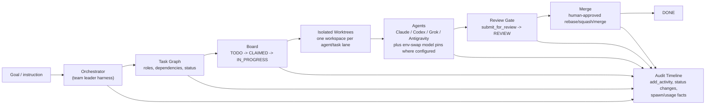

# Supported Harnesses, Models, and Architecture

Last checked: 2026-08-10.

This document is intentionally conservative. It mirrors the current v3 code instead of claiming every vendor name as a first-class harness. The source of truth is:

- `v3/electron/model-registry.ts`
- `v3/electron/model-selection.ts`
- `v3/electron/agent-config.ts`
- `v3/electron/harness-manager.ts`
- `v3/electron/harness-catalog.ts`

## Terms

Marblo separates two axes:

| Axis | Meaning | Example |
| --- | --- | --- |
| Harness | The CLI binary Marblo spawns. | `claude`, `codex`, `grok`, `agy` |
| Provider | The backend the model call reaches. | Anthropic, OpenAI, xAI, Z.ai, MiniMax, Kimi |

That distinction matters. GLM, MiniMax, and Kimi are supported today as model/provider rows running through the `claude` harness with an env-swap profile. They are not separate native harnesses in the current code.

## Harness Support

| Harness setting | Spawned CLI | Status | Orchestrator candidate | Notes |
| --- | --- | --- | --- | --- |
| `claude` | `claude` | Official | Yes | Native Claude Code path. Supports Anthropic models and env-swap providers whose registry row uses the `claude` harness. |
| `codex` / `gpt` | `codex` | Official | Yes | The stored model axis is `gpt`, but the binary is Codex CLI. Supports Codex model plus effort pins. |
| `grok` | `grok` | Experimental native harness | Yes | Optional/recommended CLI in the harness catalog. Model pins reach `-m` on both worker and orchestrator launches (the orchestrator pin axis landed 2026-08-10; it previously dropped the suffix). Each agent gets a private copy of the browser-login credential instead of a symlink into `~/.grok`, so one agent's failed token refresh can no longer delete the machine-wide login. Still Experimental: promotion waits on a live authenticated end-to-end run. |
| `antigravity` | `agy` | Official | Yes | First-class worker/orchestrator harness path. Uses the user's Antigravity/Gemini auth home; no concrete model rows are registered in `MODEL_REGISTRY` yet. |
| `gemini` | `gemini` | Deprecated legacy | No | Spawn and config code remain for compatibility, but the catalog marks Gemini CLI as deprecated/EOL for personal tier and points users to Antigravity. No current static model registry rows. |
| `local` | `claude` with local env profile | Experimental runtime registration | No | Ollama models can be registered at runtime from `ollama list` and run through the Claude Anthropic-compatible path. They are not static catalog models. |
| `custom` | User command | Experimental/custom | No | Marblo can generate a custom config path, but there is no verified model registry surface. |

## Registered Model Rows

Only active rows in `MODEL_REGISTRY` are listed. "Verified" means the repository's recorded verification method, not a fresh probe performed by this document.

| Provider | Models | Harness | Status | Verification basis |
| --- | --- | --- | --- | --- |
| Anthropic | `claude-fable-5`, `claude-opus-5`, `claude-opus-4-8`, `claude-sonnet-5`, `claude-haiku-4-5-20251001` | `claude` | Official | Claude CLI 2.1.220 probe on 2026-07-25. |
| OpenAI / Codex | `gpt-5.6-sol`, `gpt-5.6-terra`, `gpt-5.6-luna`, `gpt-5.5`, `gpt-5.4`, `gpt-5.4-mini` | `gpt` (`codex` binary) | Official | Codex CLI 0.145.0 model cache on 2026-07-25. |
| xAI | `grok-4.5` | `grok` | Experimental native harness | Grok Build docs and README check on 2026-07-26; browser-auth live use still depends on user setup. |
| Z.ai / GLM | `glm-5.2`, `glm-4.7` | `claude` env-swap | Experimental provider row | Vendor docs crawl on 2026-07-26; live model probe waits for a Coding Plan key. |
| MiniMax | `MiniMax-M3`, `MiniMax-M2.7` | `claude` env-swap | Experimental provider row | Vendor docs crawl on 2026-07-26; live model probe waits for a Token Plan key. |
| Moonshot / Kimi Code | `k3`, `k3-256k`, `kimi-for-coding` | `claude` env-swap | Experimental provider row | Kimi Code docs plus unauthenticated endpoint probe on 2026-07-27; live model serving check waits for a Kimi Code key. |

## Effort Support

| Model family | Supported effort values | Notes |
| --- | --- | --- |
| `gpt-5.6-sol`, `gpt-5.6-terra` | `low`, `medium`, `high`, `xhigh`, `max`, `ultra` | `max` and `ultra` are approval-gated in the orchestration flow. |
| `gpt-5.6-luna` | `low`, `medium`, `high`, `xhigh`, `max` | No `ultra` row in the registry. |
| `gpt-5.5`, `gpt-5.4`, `gpt-5.4-mini` | `low`, `medium`, `high`, `xhigh` | Classic Codex effort ladder. |
| Claude, Grok, GLM, MiniMax, Kimi, Antigravity, Gemini, local, custom | None in Marblo's spawn argv model registry | Some vendors may expose their own in-session controls, but Marblo does not currently pass an effort flag for these harnesses. |

## Not Supported As First-Class Claims

Do not market these as fully supported native harnesses in the current code:

| Claim to avoid | Accurate statement |
| --- | --- |
| "GLM is a native harness" | GLM is a Z.ai provider row using the `claude` harness with env-swap. |
| "MiniMax is a native harness" | MiniMax is a provider row using the `claude` harness with env-swap. |
| "Kimi is a native harness" | Kimi Code is represented through Anthropic-compatible env-swap on the `claude` harness. The native `kimi` CLI is intentionally not wired as a harness. |
| "Gemini is a recommended current harness" | Gemini spawn code remains for compatibility, but the catalog marks it deprecated and replaced by Antigravity for new personal-tier use. |
| "Every listed vendor can run without keys" | Env-swap providers require their specific key names to be configured. Marblo checks key presence and never logs raw values. |

## Architecture

The current Marblo pipeline is a task graph that fans out into isolated worktrees, then converges back through review, merge, and audit logging.

Key invariants:

- The task graph owns role, dependency, and status flow. Agents should not skip the board state machine.
- Parallel work happens in isolated worktrees, not by letting several agents mutate the same checkout.
- Finished agent work returns to `REVIEW`; human review remains the merge gate.
- Audit timeline entries are not decorative logs. `add_activity`, status changes, and review submission are the durable record that lets the orchestrator and reviewers reconstruct what happened.
- Provider/model claims must be grounded in `MODEL_REGISTRY`; unsupported names should fall back or be documented as not wired.
