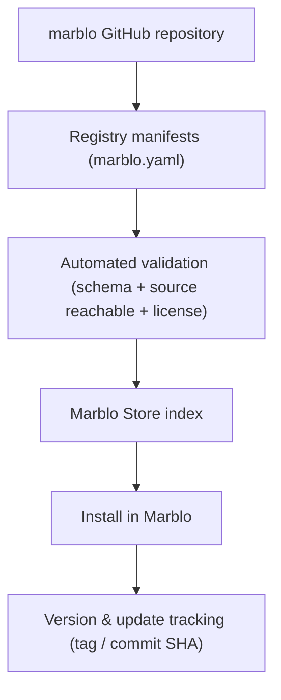

# Marblo Registry

The registry is the **index the Marblo app reads to build the Store.** Each installable item — a skill, MCP server, agent, workflow, knowledge pack, harness, or bundle — ships a `marblo.yaml` that validates against [`manifest.schema.json`](manifest.schema.json).

## Two kinds of items

**First-party (code lives here).** Skills, agents, workflows, and knowledge packs that Marblo authors and maintains keep their real files in this repo next to their `marblo.yaml`.

**Referenced (manifest only).** External projects are **not copied in.** Their `marblo.yaml` points at the upstream repository and a **pinned tag or commit SHA**. This keeps license, security patching, and ownership with the original author — see [SECURITY.md](../SECURITY.md) and [CONTRIBUTING.md](../CONTRIBUTING.md).

## Publisher tiers

| Tier        | Meaning                                                        |
| ----------- | -------------------------------------------------------------- |
| `official`  | Authored and maintained by Marblo.                             |
| `verified`  | External, reviewed by maintainers, source pinned to a tag/SHA. |
| `community` | External, contributed via PR, not yet reviewed.                |

## Categories

`harnesses` · `skills` · `mcp-servers` · `agents` · `workflows` · `knowledge-packs` · **bundles** (a manifest that installs several items at once).

## Adding an item

1. Author `marblo.yaml` (validate against the schema).
2. First-party: put real files beside it. Referenced: set `source.repository` + `source.ref`.
3. Open a PR — CI validates schema, checks the pinned source is reachable, and that a license is declared.

> Status: **v0 preview.** The manifest schema is stabilizing; `schema_version: 1` will remain readable, and breaking changes will bump it.
