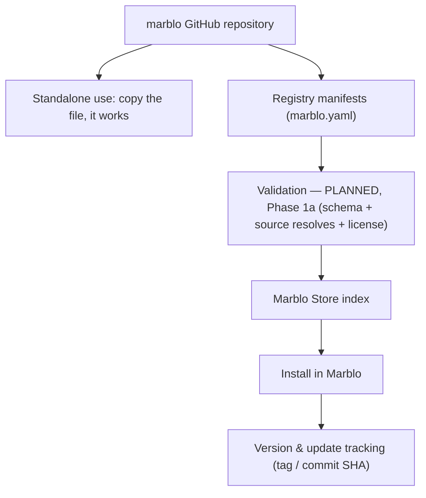

# Marblo Registry

The registry is the **index the Marblo app reads to build the Store.** Each item — a skill, MCP server, agent, workflow, knowledge pack, harness, or bundle — ships a `marblo.yaml` that validates against [`manifest.schema.json`](manifest.schema.json).

**The manifest is additive metadata, not a container.** First-party assets are plain, standards-native files that work standalone in Claude Code / Codex. Delete the `marblo.yaml` and the asset still works; what you lose is the Store listing, version tracking, and one-click install.

> ⚠️ **CI does not exist in this repo yet.** The validation step above is Phase 1a ([ROADMAP.md](../ROADMAP.md) §5). Today every check is a maintainer reading the PR.

## Where manifests live

**Manifests live in the category folder at the repo root**, next to the item they describe — `skills/<id>/marblo.yaml`, `agents/<id>/marblo.yaml`, and so on. **This `registry/` directory holds the schema and this document, not manifests.**

## Two kinds of items

**First-party (files live here).** Skills, agents, workflows, and knowledge packs that Marblo authors keep their real files in this repo next to their `marblo.yaml`, in the format the target CLI already reads.

**Referenced (manifest only).** External projects are **not copied in.** Their `marblo.yaml` points at the upstream repository and a **pinned tag or 40-hex commit SHA**, so license and ownership stay with the original author. Note that pinning freezes the dependency — upstream fixes do not reach users until the pin moves. See [SECURITY.md](../SECURITY.md).

## Publisher tiers

| Tier        | Meaning                                                        | Installable?           |
| ----------- | -------------------------------------------------------------- | ---------------------- |
| `official`  | Authored and maintained by Marblo.                             | Yes                    |
| `verified`  | External, reviewed by maintainers, source pinned to a tag/SHA. | Yes                    |
| `community` | External, contributed via PR, payload not reviewed.            | **No — listing only.** |

`community` items are discoverable and linked to their source, but not one-click-installable until the app ships a permission gate. [Why](../SECURITY.md#why-community-items-cannot-be-installed-with-one-click).

**Tier is currently self-asserted** — it is a string in a file the contributor writes, enforced only by the maintainer who reads the PR. Phase 1a derives it in CI from repository ownership and a maintainer-controlled trusted-publisher list; the app will then read the derived value, not the authored one.

## Schema rules worth knowing

- **`permissions` is required for executable types** (`skill`, `agent`, `workflow`, `mcp-server`, `harness`). An empty array is valid and means "asks for nothing"; omission is not allowed, so an undeclared item cannot render as a harmless one.
- **`source` is required whenever tier is not `official`.** Without it there is no pinned upstream to resolve, and the promise that "the pinned source resolves" would have nothing to check.
- **`source.ref` must be a version-shaped tag or a 40-hex SHA.** `main`, `master`, `develop`, and `HEAD` fail the pattern.
- **`status`** is `active` (default), `deprecated`, or `revoked`. Revocations are recorded in [SECURITY-ADVISORIES.md](../SECURITY-ADVISORIES.md); app-side enforcement lands in Phase 1a.

## Categories

`harnesses` · `skills` · `mcp-servers` · `agents` · `workflows` · `knowledge-packs` · **bundles** (a manifest that installs several items at once).

## Adding an item

1. Create `<category>/<id>/` at the repo root and author `marblo.yaml` there.
2. First-party: put real files beside it. Referenced: set `source.repository` + a pinned `source.ref`.
3. Open a PR — a maintainer reviews the manifest and the payload by hand.

See [CONTRIBUTING.md](../CONTRIBUTING.md) for the full checklist.

> Status: **v0 preview.** The manifest schema is stabilizing; `schema_version: 1` will remain readable, and breaking changes will bump it. The `install` contract (destination, runner, integrity digests) that Phase 1a needs is not in `schema_version: 1` and will arrive with `2`.
